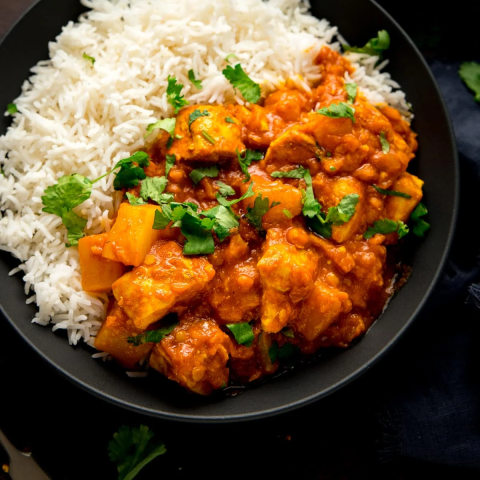

# Chicken Dhansak

*A popular sweet and sour dish, traditionally made with goat meat*

**Serves:** 4

## Ingredients
- 4 tbsp rapeseed oil or seasoned oil
- 2 tbsp garlic and ginger paste
- 1 tsp ground turmeric 
- 2 tbsp [mixed powder](../Base/mixed-powder.md)
- 1 tbsp chilli powder, or to taste 
- 125ml [tomato purée](../Base/tomato-puree.md)
- 800g [pre-cooked stewed chicken](../Base/curry-base.md)
- 500ml [base curry sauce](../Base/curry-base.md) (heated)
- 180g red split lentils, rinsed and cooked in water until soft 
- 115ml pineapple juice 
- 3-4 tinned pineapple rings, cut into pieces 
- Juice of 1 or 2 lemons, to taste 
- 3 tbsp freshly chopped coriander
- Salt 

## Method
1. Heat the oil in a pan over a medium-high heat. Spoon in the garlic and ginger paste along with the turmeric, and let sizzle for about 30 seconds. `
1. The turmeric will become darker as you do this. 
1. Now add the mixed powder, chilli powder and tomato purée and stir briskly. 
1. Pour in half of the base curry sauce and let it simmer for about a minute. 
1. Add the cooked lentils and stir it all up. 
1. Watch closely as lentils have a tendency to scorch on the bottom of the pan, so reduce the heat if necessary. 
1. Now add the rest of the sauce and the pre-cooked stewed chicken along with a splash of cooking stock or spice stock for additional flavour. 
1. Pour in the pineapple juice and add the pineapple pieces. 
1. Simmer for a further 3-5 minutes, adding more base curry sauce or stock if the mixture becomes too thick. 
1. Check for seasoning and add salt to taste. 
1. Stir in the lemon juice and top with the chopped coriander to serve. 