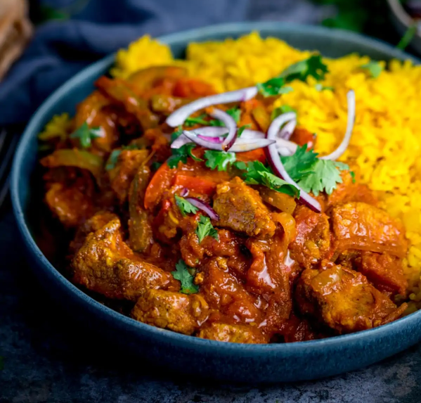

# Chicken Jalfrezi

*Jalfrezi curries are quick stir-fries that are usually served quite dry with lots of crunchy vegetables.*

**Serves:** 4

## Ingredients
- 4 tbsp rapeseed oil or seasoned oil
- 1 onion, thinly sliced 
- 1 red pepper (bell pepper), deseeded and thinly sliced 
- 3 green bird’s-eye chillies, roughly chopped 
- 2 tbsp finely chopped coriander stalks 
- 2 tbsp garlic and ginger paste 
- 6 tbsp [tomato purée](../Base/tomato-puree.md)
- 2 tbsp [mixed powder](../Base/mixed-powder.md)
- 1 tsp chilli powder
- 500ml [base curry sauce](../Base/curry-base.md) (heated)
- 700g [pre-cooked stewed chicken](../Base/curry-base.md)
- 100ml of curry base or stock from [pre-cooked stewed chicken](../Base/curry-base.md)
- 2 tomatoes, quartered 
- 1 tsp dried fenugreek leaves 
- 1 tsp [garam masala](../Base/garam-masala.md)
- Salt 
- Fresh coriander leaves (chopped)
- Green finger chillies, cut in half lengthways 

## Method
1. Heat the oil in a large frying pan over a medium-high heat then add the sliced onion, pepper (bell pepper), green chillies-and coriander stalks. 
1. Mix this all up in the pan and sauté until the vegetables are beginning to cook through but are still crisp. 
1. Stir in the garlic and ginger paste and fry for about a minute. 
1. Add the tomato purée, mixed powder, chilli powder and about 250ml of the base curry sauce. 
1. This will come to an instant bubble. 
1. Add the chicken, stock and the rest of the base curry sauce. 
1. Let this simmer over a medium heat for about 5 minutes, without stirring unless it is obviously catching on the pan. 
1. If the sauce begins to caramelize around the edges of the pan, stir this back into the curry. 
1. Add more base sauce or cooking stock if the sauce becomes too thick. 
1. About 2 minutes before serving, add the quartered tomatoes and dried fenugreek leaves. 
1. When the tomatoes are cooked through but still crisp and you are happy with the consistency, season with salt to taste and sprinkle with the garam masala. 
1. Finish by garnishing with the chopped coriander leaves and sliced chillies.