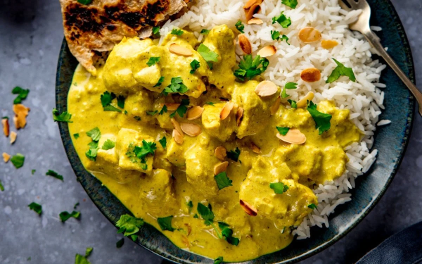

# Chicken Pasanda

*Authentic Indian pasandas can be spicy or mild, sweet and/or savoury. What makes them ‘pasanda’ has nothing to do with the sauces, which can vary greatly, but with the use of flattened meat, tenderized with a meat mallet before being added to the pan.*

**Serves:** 4

## Ingredients
- 4 tbsp almond flakes 
- 4 tbsp rapeseed oil or seasoned oil
- 3 tbsp coconut flour 
- 3 tbsp ground almonds 
- 2 tbsp sugar 
- About 20 sultanas 
- 500ml [base curry sauce](../Base/curry-base.md)
- 100g block coconut, cut into small pieces 
- 800g (174 lb) skinless, boneless chicken breast, cut into thin slices on the diagonal 
- 125ml red wine (optional) 
- 100ml (1 cup) single cream 
- 1 tsp [garam masala](../Base/garam-masala.md)
- Salt 

## Method
1. Toast the almond flakes in a dry pan over a medium-high heat until nicely browned. 
1. Transfer to a plate and set aside. 
1. Add the oil to the pan. When nice and bubbly, add the coconut flour, ground almonds and sugar. 
1. Stir this around for about 30 seconds then add the sultanas, base curry sauce and block coconut pieces. 
1. When the sauce begins to simmer, stir in the chicken. 
1. Let this simmer for about 5 minutes until the chicken is cooked through and the sauce has cooked to your preferred consistency. 
1. If the sauce caramelizes to the sides, stir it back into the sauce. 
1. At this time, you could add a splash of red wine to simmer in the sauce until the alcohol cooks out. 
1. To serve, check for seasoning, adding salt, more coconut and sugar if desired, to taste. 
1. Stir in the cream and sprinkle with the garam masala and toasted almond flakes. 

