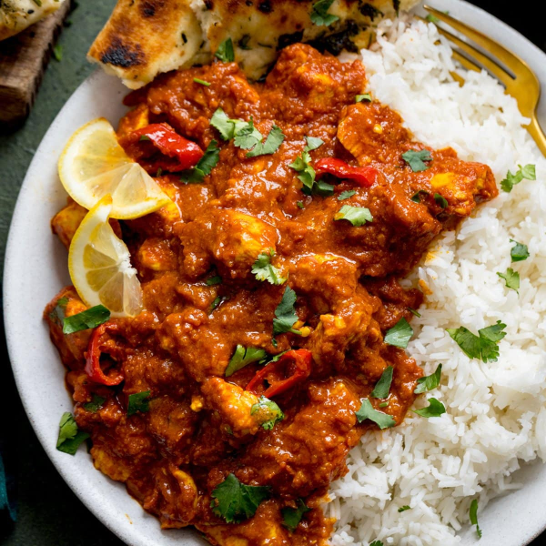

# Chicken Pathia

*A classic BIR dish that is sweet, sour, and hot*

**Serves:** 4

## Ingredients
- 4 tbsp rapeseed oil or seasoned oil
- 1 small onion, very finely chopped 
- 2 tbsp garlic and ginger paste
- 2 tbsp [mixed powder](../Base/mixed-powder.md)
- 1 tsp chilli powder 
- 2 tbsp sugar 
- 125ml [tomato purée ](../Base/tomato-puree.md)
- 500ml [base curry sauce](../Base/curry-base.md) (heated )
- 800g [pre-cooked stewed chicken](../Base/pre-cooked-chicken.md)
- 125ml of curry base or stock from [pre-cooked stewed chicken](../Base/curry-base.md)
- 1 tbsp smooth mango chutney 
- 1 tsp tamarind concentrate 
- 1 tsp dried fenugreek leaves 
- Juice of 1 or 2 lemons, to taste 
- 3 tbsp chopped fresh coriander 
- Salt 

## Method
1. Heat the oil in a large pan over a medium-high heat until bubbling hot. 
1. Stir in the chopped onion and fry until translucent and soft, then add the garlic and ginger paste and let it sizzle for about a minute. 
1. Sprinkle a little salt over the mixture as this will help release 
moisture. 
1. Cook for about another minute then add the mixed powder, chilli powder and sugar. 
1. Stir briskly. 
1. Stir in the tomato purée and 250ml of the base curry sauce. 
1. Let this come to a rolling simmer and scrape back in any caramelized sauce from the sides of the pan. 
1. Add the rest of the base sauce and the stock, followed by the pre-cooked chicken. 
1. Let this bubble and spit until reduced down to your preferred consistency. 
1. Add a little more base sauce or stock if you want more sauce. 
1. To finish, stir in the mango chutney, tamarind, dried fenugreek leaves and lemon juice to taste. 
1. Taste the curry, and if you want it to be sweeter, add some more sugar or mango chutney, or more lemon juice if you want it to have more of a tang. 
1. Check for seasoning, and add salt to taste to serve. 
1. Serve garnished with the chopped coriander. 