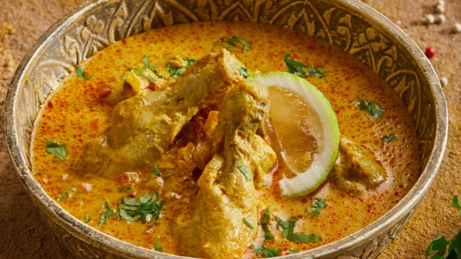

# Chicken Korma

**Serves:** 4

## Ingredients
- 4 tbsp ghee, rapeseed oil or seasoned oil 
- 800g [pre-cooked stewed chicken](../Base/pre-cooked-chicken.md)
- 2.5cm piece of cinnamon stick or cassia bark 
- 4 green cardamom pods, lightly bruised 
- 1 tsp garlic and ginger paste 
- 3 tbsp sugar, or to taste 
- 6 tbsp ground almonds 
- 2 tbsp coconut flour 
- 700ml [base curry sauce](../Base/curry-base.md)
- 100g block coconut
- 1 tbsp garam masala (see p14) 
- 125ml single cream, plus a little more to finish 
- 1 tbsp rose water or to taste 
- 2 tbsp cold butter (optional) 
- Salt 

## Method
1. Heat the ghee or oil in a large frying pan over a medium heat. 
1. When small bubbles begin to appear, toss in the cinnamon stick and cardamom pods. 
1. Let the whole spices flavour the oil for about 30 seconds then stir in the garlic and ginger paste. 
1. Fry for about 20 seconds before adding the sugar, ground almonds and coconut flour. 
1. Mix into the oil and pour in about 250ml of the base curry sauce; it will bubble up nicely. 
1. Break up the block coconut, if using block, and add it to the simmering sauce. It will dissolve and give your korma a nice light yellow tone. 
1. Pour in the rest of the base curry sauce, then add the chicken. 
1. Swirl in the garam masala. 
1. When your chicken is cooked/heated through, remove the cardamom pods and cinnamon, and stir in the cream. 
1. Add the rose water and finish with the butter, if you want. 
1. Season with salt to taste and check the sweetness, adding more sugar if needed.