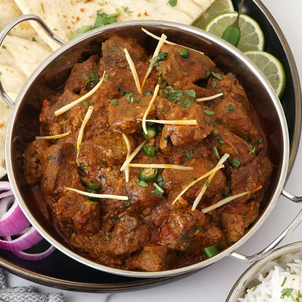

# Lamb Karahi

**Serves:** 4

## Ingredients
- 800g (174lb) lamb leg and shoulder, cut into pieces, ideally still with bone in 

### Marinade
- 1 tbsp rapeseed oil 
- 100g (74 cup) Greek yoghurt 
- 2 tbsp garlic and ginger paste 
- 1 tsp salt 
- 1 tbsp freshly ground black pepper 

### Sauce
- 4 tbsp rapeseed oil 
- 2 tbsp garlic and ginger paste 
- 1 quantity [fried onions](../Base/fried-onion-paste.md)
- 1 tbsp pungent dried red chilli flakes 
- 2 large tomatoes (diced )
- 112 tbsp ground cumin 
- 142 tbsp ground coriander 
- 1 tbsp Kashmiri chilli powder 
- 3 tbsp julienned ginger 
- 2 fresh green bullet chillies (roughly chopped)
- 1 tsp [garam masala](../Base/garam-masala.md)
- Fresh coriander 

## Method
1. Mix the meat pieces with the marinade ingredients in a large bowl and cover with cling film. 
1. Leave to marinate in the fridge for at least 2 hours, or ideally overnight; the longer the better. 
1. When ready to cook, heat the oil in a pan over a medium-high heat and add the garlic and ginger paste. 
1. Stir this around for about 30 seconds then add the meat and all the marinade. 
1. Using a large spoon, stir to coat the meat with the garlicky oil. 
1. Add the fried onions, chilli flakes and tomatoes and again stir it all up to combine. 
1. Now sprinkle in the ground cumin, coriander and chilli powder. 
1. Pour in just enough water to cover and let it all simmer for a good 40 minutes to 1 hour. 
1. You may need to top up the water from time to time. 
1. Check for seasoning and add more salt or spices to taste. 
1. This is a quite dry curry so that it can easily be soaked up with fresh naans. 
1. When the meat is really tender, add the julienned ginger, fresh chillies and garam masala and serve topped with fresh coriander 