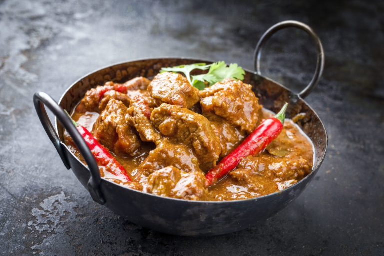

# Lamb Madras

*A sweet, sour Madrass with smooth mango chutney and a twist of lime*

**Serves:** 4

## Ingredients
- 3 tbsp rapeseed oil or seasoned oil 
- 2-4 Kashmiri dried red chillies, to taste 
- A few green cardamom pods, lightly bruised 
- 3 tbsp garlic and ginger paste
- 2 fresh green chillies (finely chopped)
- 125ml [tomato purée](../Base/tomato-puree.md)
- 2 tbsp ground cumin 
- 1 tsp ground coriander 
- 1/4, tsp ground turmeric 
- 1-2 tbsp chilli powder
- 2 tbsp [mixed powder](../Base/mixed-powder.md)
- 500ml [base curry sauce](../Base/curry-base.md) (heated )
- 800g [pre-cooked stewed lamb](../Base/pre-cooked-lamb.md)
- 250ml of curry base or stock from [pre-cooked stewed lamb](../Base/pre-cooked-lamb.md)
- 1-2 tbsp smooth mango chutney
- Juice of 1 lime 
- Pinch of [garam masala](../Base/garam-masala.md)
- Fresh coriander to garnish 
- Salt 

## Method
1. Heat the oil in a pan over a medium-high heat until hot. 
1. Add the dried chillies and cardamom pods, and allow to sizzle for about 30 seconds. 
1. Be sure to count the cardamom pods in and count them back out again at the end of cooking if you don’t like biting into whole spices. 
1. Scoop in the garlic and ginger paste along with the chopped chillies. 
1. Allow them to sizzle for about 20 seconds then stir in the tomato purée followed by the ground cumin, coriander and turmeric, the chilli powder and mixed powder. 
1. Now add 250ml of the base curry sauce along with the lamb. 
1. Simmer for about 2 minutes, without stirring unless it is obviously catching on the pan, scraping back in any caramelized sauce from the sides of the pan. 
1. Pour in the rest of the base curry sauce and the stock, and let it simmer over a high heat until it has reduced down to your preferred consistency. 
1. To serve, stir in the mango chutney and lime juice. 
1. Check for seasoning and add salt to taste. 
1. Sprinkle with the garam masala and garnish with the chopped coriander.

**Note**: If you are looking for a more savoury flavour, spicy lime pickle can be substituted for the mango chutney. 
