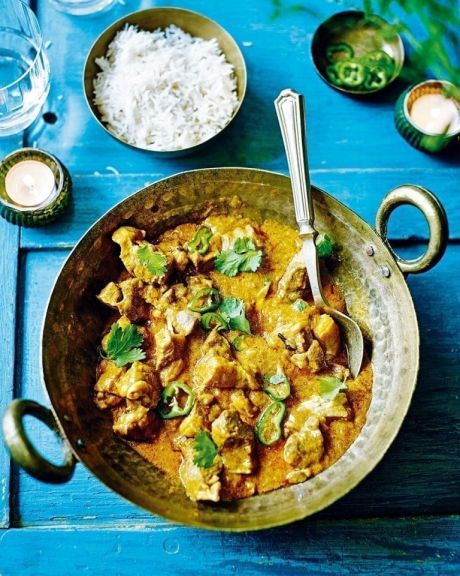

# Lamb Nihari

*A mild sauce that has a delicious flavour that when mixed with tender lamb shanks. Lamb nihari is a fantastic all-round option for entertaining. Your guests can add chopped green chillies, lemon juice, julienned ginger and fresh coriander (cilantro) to taste at the table. If you want the curry to be fiery hot, add loads of chillies*

**Serves:** 4

## Ingredients
- 4 lamb shanks
- 125ml  rapeseed oil or seasoned oil
- 1 whole nutmeg, crushed into smaller pieces 
- 1 tbsp mace blades 
- 2 tbsp fennel seeds 
- 3 Indian bay leaves (shredded)
- 1 inch piece of cinnamon stick broken into small pieces 
- 1 tsp black peppercorns 
- 1 tsp nigella seeds (black onion seeds) 
- 1 tsp cloves 
- 2 tsp cumin seeds 
- 1 tsp paprika 
- 1 tsp hot chilli powder 
- 1 tsp ground ginger 
- 40g unsalted butter 
- 1 onion, sliced into rings 
- 2 generous tsp chapatti flour 
- Salt 

### Garnishes
- 4 tbsp (or more) fine julienne of ginger 
- 2-3 hot fresh green chillies (finely sliced)
- Handful of coriander leaves 
- Lemon wedges 

## Method
1. Place the lamb shanks on a plate and rub them all over with 7 tsp salt and 1 tsp of the oil. 
1. Set aside while you prepare the spice masala. This is a raw spice masala so no need to roast the spices first. 
1. Put the nutmeg, mace, fennel seeds, bay leaves, cinnamon, peppercorns, nigella seeds, cloves and cumin seeds in a spice grinder and grind to a fine powder. 
1. Stir in the paprika, chilli powder and ground ginger. 
1. Melt the butter in a large saucepan with a tight-fitting lid over a medium heat. 
1. Add the onion rings and fry for about 5 minutes until soft, translucent and lightly browned. 
1. Transfer to a plate with a slotted spoon and set aside. 
1. Pour the remaining oil into the saucepan and brown the lamb shanks for about 2 minutes. 
1. Add the browned onions coated with the spices and pour in 1.2 litres (434 cups) warm water. 
1. Arrange the lamb shanks in the saucepan, cover and simmer over a low heat for 3 hours, basting and turning the shanks every 30 minutes. 
1. After 3 hours, carefully lift out the shanks into a large, warmed serving bowl. 
1. Skim offas much excess oil from the cooking liquid as possible from the sauce and discard. 
1. Mix the chapatti flour with 4 teaspoons water to make a smooth paste. 
1. Whisk the paste into the sauce and simmer for 5-6 minutes to thicken. 
1. Check for seasoning, add salt to taste and then pour the sauce over the meat in the serving bowl. 
1. Serve the garnishes in little bowls on the table to add to the lamb nihari as you like. 

