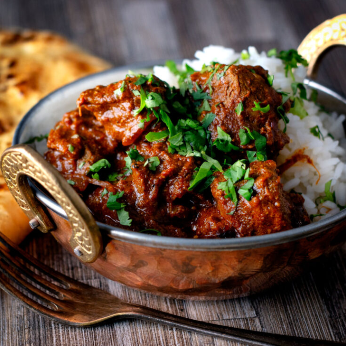

# Lamb Rogan Josh

**Serves:** 4

## Ingredients
- tbsp rapeseed oil or seasoned oil
- 2 tbsp garlic and ginger paste 
- 2 tbsp paprika 
- 1 tsp chilli powder, or more to taste 
- 125ml [tomato purée](../Base/tomato-puree.md)
- 500ml [base curry sauce](../Base/curry-base.md) (heated )
- 1 tbsp ground cumin 
- 1½ tbsp [mixed powder](../Base/mixed-powder.md)
- 700g [pre-cooked stewed lamb](../Base/pre-cooked-lamb.md)
- 200ml of curry base or stock from [pre-cooked stewed lamb](../Base/pre-cooked-lamb.md)
- 2 tomatoes, quartered 
- 2-3 tbsp [raw cashew paste](../Base/raw-cashew-paste.md)
- 3 tbsp plain yoghurt 
- 1 tsp dried fenugreek leaves 
- 1 tsp garam masala (see p14) 
- 3 tbsp chopped coriander leaves 
- Chopped red onion, to garnish 
- Salt 

## Method
1. Heat the oil in a large frying pan over a medium-high heat until hot. 
1. Add the garlic and ginger paste and let it sizzle for about 30 seconds, stirring continuously. 
1. Add the paprika and chilli powder and fry for about 30 seconds. 
1. The mixture should turn a darker red as it cooks. 
1. Pour in the tomato purée, which should start to bubble as soon as it hits the pan. 
1. Cook it down by about half then stir in 250ml of the base curry sauce, the cumin and mixed powder. 
1. Allow the sauce to simmer for a couple of minutes, without stirring unless it is obviously catching on the pan. 
1. Some of the sauce should caramelize to the sides of the pan; you want to scrape it off from time to time as it adds a nice smoky flavour. 
1. Add the pre-cooked lamb and the rest of the base sauce with the stock. 
1. Let the sauce come to a boil until it reduces to your preferred consistency, only stirring if it is catching. 
1. Add the tomato wedges to the sauce. 
1. To serve, swirl in the cashew paste then add the yoghurt 1 tbsp at a time, stirring continuously. 
1. Sprinkle with the dried fenugreek leaves, garam masala and add salt to taste. 
1. Top with the coriander and garnish with chopped red onion and a little plain yoghurt. 
