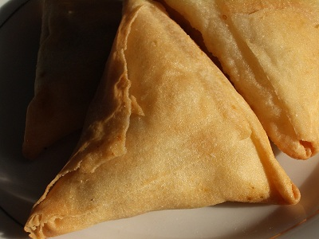

# Samosas

*These popular golden stuffed parcels can be filled with a variety of vegetable or meat mixtures. Here they are  stuffed with spiced minced chicken.*

**Serves:** 20

## Ingredients
- 2 tablespoons sunflower oil
300 grams minced chicken
- 1 onion (chopped)
- 1 tablespoon medium curry powder
- 50 grams cooked potato (diced)
- 4  tablespoons coriander leaves (freshly chopped)
- 4 tablespoons mint leaves (freshly chopped)
- 5 sheets filo pastry (25 x 50 cm)
- 1 egg (beaten)
- salt and freshly ground black pepper

## Method
1. Heat the sunflower oil in a frying pan.
1. Add the chicken, onion and curry powder.
1. Season and cook for about 10 minutes, uncovered, until the chicken is just cooked and the juices have evaporated from the pan.
1. Add the potato and mix well.
1. Remove the pan from the heat and stir in the chopped coriander and mint.
1. Leave to cool

### To assemble
1. Lay the filo pastry out on a clean board and cut in half length-ways, then once more width-ways, so that you have 4 rectangles from each whole sheet.
1. Cover all the pieces of filo with a barely damp tea towel to prevent them from drying out.
1. Take one piece of filo and lay it width-ways in front of you.
1. Pile a dessert spoon of the chicken mixture on to the end closest to you.
1. Fold the filo over the filling to form a triangle and continue to fold and enclose the filling until you have a triangular parcel.
1. Brush the finishing edge with a little of the beaten egg to seal, then place on a baking tray.
1. Glaze the finished samosa all over with beaten egg and repeat the process until you have 20 samosas.
1. These can be prepared earlier in the day up to this point and chilled in the fridge.
1. When ready to bake the samosas, preheat the oven to 200°C.
1. Bake the samosas in the preheated oven for 10 - 12 minutes, until golden brown in colour.