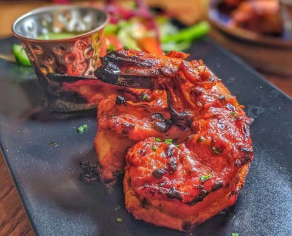

# Tandoori King Prawn

**Serves:** 4

## Ingredients
- 500g raw king prawns (peeled and de-veined)

### First marinade
- 1 tbsp rapeseed oil 
- 2 tsp garlic and ginger paste
- 1/4 tsp ground turmeric 
- 1 tsp salt 
- 1/2 tsp finely ground white pepper 

### Second marinade
- 2 tbsp Greek yoghurt 
- 1 tbsp cream cheese 
- 1 tbsp single (light) cream 
1cm piece of ginger (peeled and finely chopped)
- 1 fresh green chilli (finely chopped)
- 1 tbsp chopped fresh coriander
- 1 tsp mace and cardamom (ground)
- 1 tsp salt 
- 1 tsp garlic powder 
- 1 tsp ajwain (carom) seeds 

## Method
1. Prepare your barbecue for direct heat cooking). 
1. Mix the prawns with the ingredients for the first marinade and set aside. 
1. Combine all the ingredients for the second marinade and work them together with your hands until you have a smooth emulsion. 
1. Cover the prawns with this marinade and leave for about 20 minutes. 
1. Thread the prawns onto skewers and place over the hot fire. (You can also cook them directly on a barbecue grill.) 
1. Cook, turning frequently, until lightly charred and cooked through. 