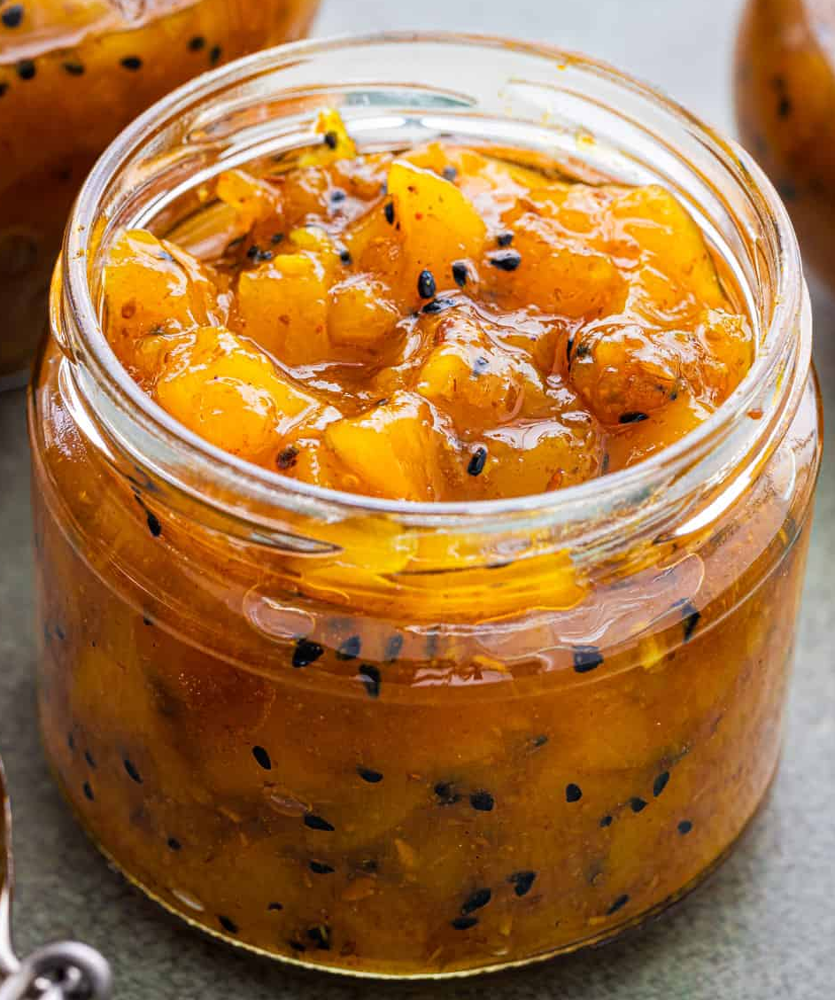

# Mango Chutney

*Mango chutney is easy to prepare. You can make it either sweet, or sweet and spicy. Once you have finished cooking the chutney, you can serve it chunky or blend it until smooth.*

**Yield:** 2 jars

## Ingredients
- 400g sugar 
- 250ml distilled white vinegar 
- 4-5 green mangoes, peeled and cubed 
- 1 onion, chopped 
- Large handful of raisins 
- 5cm (2 in) ginger (peeled and finely chopped)
- 3 garlic cloves (finely chopped)
- 1 tsp black mustard seeds 
- 1 tsp chilli powder (optional) 
- Salt (optional) 

## Method
1. Put the sugar and vinegar in a large saucepan and bring to a boil, stirring continuously until the sugar dissolves. 
1. Add the remaining ingredients and simmer for about 1 hour, stirring regularly until syrupy. 
1. When it is sticky and thick to your liking you can either leave it as it is or blend until smooth 
1. Transfer to hot sterilized jars, leaving a little space at the top. 

