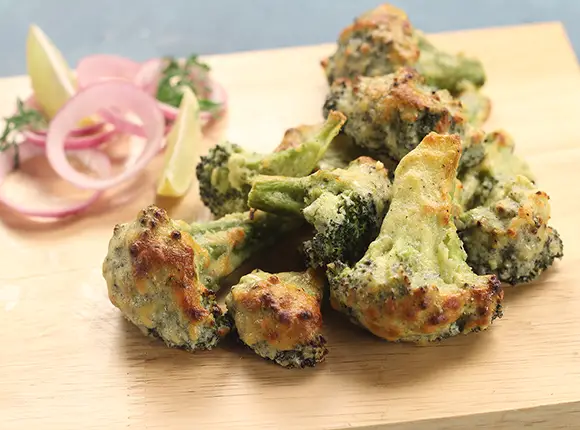

# Tandoori Broccoli, Cauliflower and Red Onion

*This is a tasty way of serving these vegetables. They can be served as a side dish or you could add the vegetables to any curries in this book to make a vegetarian version.*

**Serves:** 

## Ingredients
- 1 head of broccoli, separated into bite-sized florets 
- 1 head of cauliflower, separated into bite-sized florets 
- 1 red onion, quartered and divided into individual petals 
- 3 tbsp gram (chickpea) flour 
- 2 tbsp plain yoghurt 
- 1 tbsp rapeseed oil 
- 1 tbsp [garam masala](../Base/garam-masala.md)
- 1 tsp chilli powder 
- Pinch of ground turmeric 
- Juice of 1 lemon 
- Salt 

## Method
1. Bring a pan of water to a boil and add the broccoli and cauliflower florets. 
1. Boil for 2-3 minutes to par-cook them. 
1. Drain and leave to cool. 
1. Put the cooled vegetables in a large bowl with the onion. 
1. Mix together the chickpea (gram) flour, yoghurt, oil, garam masala, chilli powder, turmeric and lemon juice, and pour over the vegetables. 
1. Stir so that all of the vegetables are equally coated. 
1. When ready to cook, prepare your barbecue for direct heat grilling. 
1. Thread the vegetables onto skewers and cook directly over the hot coals until cooked through and charred. 
1. Season with salt and serve immediately. 