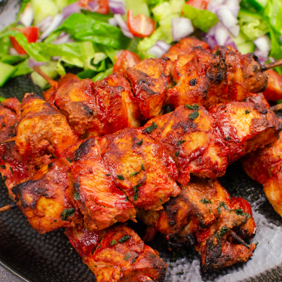

# Chicken Tikka

*Red food colouring powder is often added to chicken tikka to give it the appearance of being spicy hot.*

**Serves:** 4

## Ingredients
- 1kg skinless, boneless chicken breasts, cut into bite-sized pieces (tikka) 
- Juice of 2 lemons 
- 3 tbsp garlic and ginger paste 
- Red food colouring powder 
- Salt 

### Marinade
- 210g (1 cup) Greek yoghurt (whisked)
- 1 tbsp ground cumin 
- 1 tbsp ground coriander 
- 1 tbsp [garam masala](../Base/garam-masala.md)
- 1 tbsp [tandoori masala](../Base/tandoori-masala-powder.md)
- 1 tsp amchoor (dried mango powder) 
- 1 tsp ground turmeric 
- 1 tsp paprika or chilli powder 
- 2 fresh green chillies (finely chopped)
- 3 tbsp finely grated Parmesan cheese 
- 20g coriander leaves (finely chopped)
- 1 tsp salt 
- 1 tbsp freshly ground black pepper 

## Method
1. Place the chicken pieces in a large bowl, squeeze the lemon juice over them and sprinkle with a little salt. 
1. Stir in the garlic and ginger paste and some red food colouring, if you want the authentic chicken tikka colour. 
1. Mix it all up really well and set aside while you make the marinade. 
1. Place the marinade ingredients in a bowl and mix with your hands until good and smooth. 
1. Cover the chicken pieces with the marinade, ensuring they are completely coated. Cover and marinate in the fridge for at least 6 hours or up to 48 hours; the longer the better. 
1. When ready to cook, prepare your barbecue for direct cooking. 
1. When your coals are white hot, thread the chicken tikka onto skewers and place over the coals, turning occasionally until the chicken is cooked through and the edges are blackened (You can also do this on a grill)
1. Season with salt to taste and serve hot, or use in your curries. 