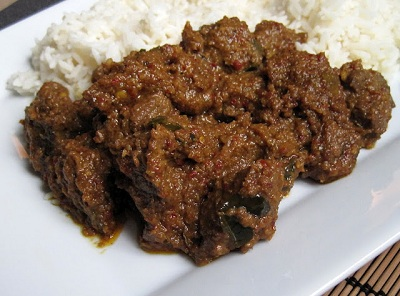

# Beef Rendang

*Rendang is a spicy meat dish which originated from the Minangkabau ethnic group of Indonesia, and is now commonly served across the country. One of the characteristic foods of Minangkabau culture, it is served at ceremonial occasions and to honour guests*

*For the tamarind water, all you do is soak 60 grams of pulp in 125 ml of hot water and leave for 5 minutes.  Break up the pulp with your fingers and then strain the syrupy mixture through a fine-meshed conical sieve discarding the fibrous material and seeds.*

**Serves:** 6

## Ingredients
**For the Rendang spice paste** 
- 100 grams grated fresh coconut
- 8 dried Kashmiri chillies
- 2 tablespoons coriander seeds
- 1 teaspoon of cumin seeds
- 1 teaspoon of turmeric powder
- 225 grams shallots (roughly chopped)
- 30 grams garlic - roughly chopped
- 50 grams peeled galangal or ginger
- 6 hot red birds eye chillies (de-seeded and roughly chopped)

**For the Beef rendang**
- 3 tablespoons of coconut oil
- 1.5 kg of braising steak (cut into chunks)
- 800 ml canned coconut milk
- 4 lemon grass stalks (bruised)
- 12 dried kaffir lime leaves (crumbled)
- 2 cinnamon sticks
- 125 ml Tamarind water
- 1 tablespoon of palm sugar

## Method
### To make the paste
1. Heat a dry, heavy based, frying pan over a medium heat. 
1. Add the coconut and stir for a few minutes until it is richly golden - don't let it burn.
1. Tip into a food processor and leave to cool.
1. Meanwhile, put the dried kashmiri chillies, coriander seeds and cumin seeds into a spice grinder and grind to a fine powder.
1. Add this to the processor with the rest of the spice paste ingredients and 100 ml of water. 
1. Blend to a smooth-ish paste.

### To make the rendang
1. Heat the coconut oil or vegetable oil in a large, heavy based frying pan. 
1. Add the beef and fry briefly until it has changed colour but not browned. 
1. Add the spice paste, coconut milk, lemon grass, lime leaves and cinnamon sticks and 1 and a half teaspoons of salt.
1. Bring to the boil, reduce the heat, add the tamarind water and leave to simmer, uncovered for 2 and a half hours, stirring occasionally, and more frequently towards the end of cooking, until the beef is tender and the sauce has reduced and thickened.
1. Remove the lemongrass from the rendang and stir in the palm sugar and season to taste.
1. Serve straight away with some Jasmine rice. 