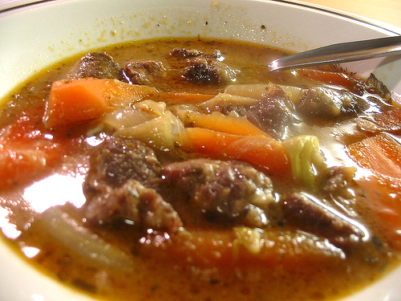

# Irish stew

**Serves:** 4

## Ingredients
- 750 grams middle next of lamb (cut into chunks)
- 100 grams butter
- 4 onions (sliced)
- 450 grams potatoes (peeled and cut into 2 cm dice)
- 1 garlic clove
- 1 bouquet garni
- 1.5 litres chicken stock
- 175 grams carrots (diced)
- 6 celery sticks (cut into 2 cm dice)
- 225 grams savoy cabbage (shredded)
- salt and freshly ground black pepper
- 2 teaspoons parsley (freshly chopped)

## Method
1. Cover the meat with cold water in a large pan and bring to the boil.
1. As soon as the water beings to boil, drain and refresh the meat in cold water, and drain well.
1. Melt the butter in a large braising pan and add the sliced onions, half the diced potatoes and the garlic.
1. Add the bouquet garni to the pan and sweat for 2 minutes.
1. Add the lamb and cover with the chicken s
tock.
1. Bring the stock to the simmer, cover and cook for 30 minutes.
1. The meat will be half cooked and the potatoes will have started to purée and thicken the stock.
1. Add the diced carrots and continue to cook for a further 10 minutes.
1. Add the remaining potatoes and the diced celery and cook for 15 - 20 minutes.
1. At this stage we do not want to purée the potatoes but just cook them until soft.
1. Add the cabbage and cook for another 2 - 3 minutes until the meat and vegetables are tender.
1. Season with salt and pepper, remove the bouquet garni and serve immediately topped with the chopped parsley.
