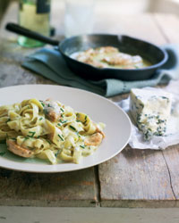

# Fettuccine with chicken and Dolcelatte

*Fettuccine con pollo e Dolcelatte*

*This wonderful, satisfying meal has amazing flavour and depth provided by the white wine, chives and Dolcelatte cheese. If you prefer, you can substitute the Dolcelatte with Gorgonzola.*

**Serves:** 4

## Ingredients
- 2 tablespoons olive oil
- 350 grams boneless and skinless chicken breast (cut into strips)
- 200 grams Dolcelatte cheese (cut into chunks)
- 150 ml double cream
- 50 ml dry white wine
- 3 tablespoons chives (freshly chopped)
- 400 grams fresh fettuccine (or tagliatelle)
- salt and pepper to taste

## Method
1. Heat the oil in a medium saucepan over a medium heat and fry the chicken for about 6 minutes until golden all over, stirring occasionally with a wooden spatula.
1. Add the Dolcelatte to the pan, lower the heat and cook for 2 minutes, stirring until melted.
1. Pour in the cream and wine and continue to cook for a further minute, stirring continuously.
1. Mix in the chives and season in a large saucepan of boiling salted water until al dente. 1. Drain and tip back into the same pan.
1. Pour in the chicken sauce and stir everything together for 30 seconds to allow the sauce to coat the pasta evenly.
1. Serve immediately.