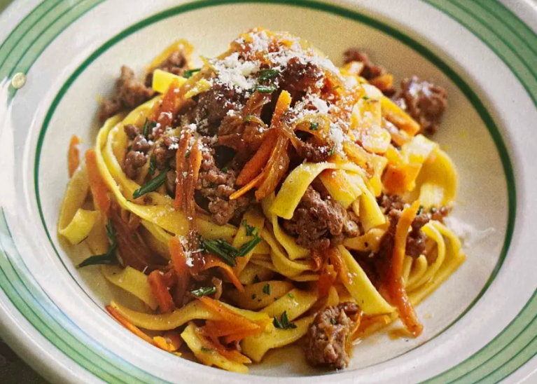

# Fettuccine with sweet onion, rosemary and lamb

*Fettuccine alle cipolle*

*This dish brings all the flavours of roast lamb, fresh rosemary and sautéd onions with a glass of wine to a plate of pasta. It is truly sensational, and very easy to prepare.*

**Serves:** 4

## Ingredients
- 6 tablespoons olive oil
- 3 large onions (peeled and finely sliced)  
- 1 carrot (peeled and finely grated)
- 1 tablespoon fresh rosemary (chopped)
- 200 grams top quality minced lamb
- 200 ml dry white wine
- 300 ml vegetable stock
- 400 grams fettuccine
- 100 grams Parmesan (freshly grated)
- salt and pepper to taste

## Method
1. Heat the olive oil in a large saucepan and fry the onions, carrot and rosemary for 5 minutes over a medium heat until softened and golden. Stir occasionally with a wooden spatula.
1. Add the lamb mince and mix well, allowing the begin to crumble. Continue to cook for 5 minutes stirring frequently, so the meat browns all over.
1. Pour in the wine and cook for a further 3 minutes to allow the alcohol to evaporate.
1. Season with salt and pepper, then pour in the vegetable stock.
1. Bring to the boil over a medium and heat then lower the heat. Leave to simmer, uncovered for 30 minutes. Stir every 10 minutes.
1. Meanwhile, cook the pasta in a large saucepan of boiling salted water until al dente.
1. Drain the pasta and immediately add to the meat sauce. Increase the heat to high and gently mix the sauce and the pasta together for 30 seconds to allow the sauce to coat the pasta evenly. Stir constantly.
1. Serve immediately, topped with freshly grated Parmesan cheese.