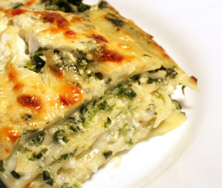

# Lasagne

*Lasagne con pesto*

*This is possibly one of the best lasagne recipes, the addition of the pesto compliments the béchamel sauce perfectly. Do not feel tempted to use shop bought lasagne sheets for this dish, take the time to make your own because they will melt in your mouth, and make this lasagne stand out above the rest and taste divine. Buon appetito!*

**Serves:** 6-8

## Ingredients
- 3 tablespoons of olive oil
- 1 onion (peeled and finely chopped)
- 1 large carrot (peeled and finely chopped)
- 1 celery stick (finely chopped)
- 500 grams minced beef
- 350 ml Italian red wine
- 700 ml passata
- 1 tablespoon tomato purée
- 12 fresh lasagne sheets
- 50 grams cold salted butter (cut into 1 cm cubes)
- salt and pepper to taste

**For the béchamel**
- 100 grams salted butter
- 100 grams plain flour
- 1 litre cold full-fat milk
- 1/4 teaspoon nutmeg (freshly grated)
- 100 grams Parmesam n (freshly grated)

**For the pesto**
- 40 grams fresh basil leaves
- 1 garlic clove (peeled)
- 30 grams pine nuts
- 120 ml extra virgin olive oill0⅕
- 20 grams Parmesan (freshly grated)
- pinch of salt

## Method
Preheat the oven to 180°C / 160°C fan.

**For the pesto**
1. Place the basil, garlic and pine nuts in a food processor, pour in the oil and purée for about 20 seconds until the mixture is smooth. 
1. Transfer the mixture into a bowl and fold in the Parmesan. Season with salt and set aside.

**For the meat sauce**
1. Heat the olive oil in a large saucepan and cook the onions, carrot and celery for 5 minutes on a medium heat.
1. Add the minced beef and continue to cook for a further 5 minutes, stirring continuously until coloured all over.
1. Season with salt and pepper and cook for a further 5 minutes, stirring occasionally.
Pour in the wine, stir well and cook for about 3 minutes to allow the alcohol to evaporate. 
1. Add the passata and tomato purée, lower the heat to a bare simmer and continue to cook for 1 hour, uncovered until you get a beautiful rich sauce. 
1. After about 30 minutes, taste for seasoning.

**For the béchamel**
1. Melt the butter in a small, heavy based saucepan over a low heat, and then add the flour. 
1. Stir with a whisk, and cook gently for 2-3 minutes to make a white roux.
1. Pour the cold milk on to the roux, whisking as you do so, and bring to the boil over a medium heat, whisking continuously.
1. When the sauce comes to the boil, lower the heat and simmer gently for about 10 minutes, stirring frequently.
1. Season to taste with freshly ground salt and pepper. 
1. Add about 1/4 a teaspoon of freshly ground nutmeg if you wish, and pass through a fine-meshed conical sieve.
1. Stir in half of the Parmesan and all of the pesto.

**To assemble**
1. Spread a quarter of the béchamel over the bottom of a deep oven-proof dish measuring 30 x 25 cm and lay about 4 lasagne sheets on top, trimming the pasta to fit the dish. 
1. Spread half of the meat sauce over the lasagne then top with a third of the remaining béchamel sauce.
1. Lay four more sheets on top and cover with the remaining meat sauce.
1. Spread half of the remaining béchamel on top, making sure all the pasta sheets are covered.
1. Sprinkle with the remaining Parmesan and scatter over the cubed butter.
1. Scatter over four turns of the pepper mill over the lasagne.
1. Place on the bottom shelf of the oven for 30 minutes, then place in the middle of the oven and increase the temperature to 200°C / 180°C fan for a further 15 minutes until golden and crispy all over.
1. Once ready, leave the lasagne to rest for 5 - 10 minutes, this will make it easier to cut and serve as the pasta layers will hold together.