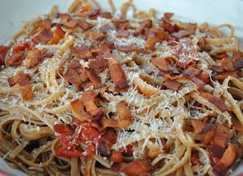

# Linguine with cherry tomatoes, pancetta and white wine

*Linguine alla amatriciana*

*The combination of onion, pancetta and chilli really makes this amazing dish of of the classics.*

**Serves:** 4

## Ingredients
- 4 tablespoons olive oil
- 1 large red onion (peeled and finely sliced)
- 250 grams diced pancetta
- 100 ml dry white wine
- 800 grams cherry tomatoes (tinned, or de-seeded)
- 1/2 teaspoon dried chilli flakes
- 500 grams linguine
- 3 tablespoons flat leaf parsley (freshly chopped)
- 100 grams Percorino Romano (freshly grated)
- salt to taste

## Method
1. Heat the oil in a large frying pan over a medium heat, and fry the onion, stirring with a wooden spatula.
1. Add the pancetta and continue to cook for a further 3 minutes.
1. Pour in the white wine and cook for a further 2 minutes, to allow the alcohol to evaporate.
1. Add the cherry tomatoes and chilli, stir well and gently simmer for 8 minutes, uncovered, stirring every couple of minutes. Once the sauce is ready, season with salt, remove from the heat and set aside.
1. Meanwhile, cook the pasta in a large saucepan of salted boiling water until al dente. Drain and tip back into the same pan. Pour in the sauce and add the parsley.
1. Stir everything together for 30 seconds to allow the flavours to combine.
1. Serve immediately, sprinkled with Percorino Romano.