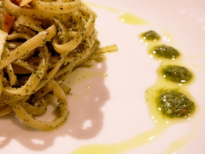

# Linguine with Genovese basil pesto

*Linguine al pesto Genovese*

*This wonderful pesto coated pasta dish is easy to make, and tastes truly stunning. It is the perfect dish to eat in the evening with fresh warm bread, and a glass of dry white wine.*

**Serves:** 4

## Ingredients
- 50 grams fresh basil (leaves only)
- 50 grams pine nuts
- 1 garlic clove (peeled)
- 130 ml extra virgin olive oil
- 25 grams Parmesan (freshly grated)
- 500 grams linguine
- salt and pepper to taste

## Method
1. Place the basil, pine nuts and garlic in a food processor. Drizzle in the oil and purée to a smooth paste.
1. Transfer the basil mixture into a large bowl and fold in the Parmesan. Season with a little salt.
1. Cook the pasta in a large saucepan of boiling salted water until al dente. Drain and tip into the bowl with the pesto.
1. Toss everything together for 30 seconds to allow the pesto to coat the pasta evenly.
Serve immediately.