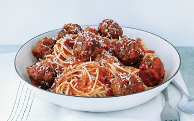

# Spaghetti with meatballs

**Prep Time:** 25 minutes (plus 30 minutes chilling)
**Cooking Time:** 50 minutes
**Serves:** 4

## Ingredients
- 2 tablespoons olive oil
- 500 grams fusilli pasta

### For the meatballs
- 1 onion (finely chopped)
- 750 grams mince (pork, veal or beef)
- 140 grams fresh breadcrumbs
- 35 grams Parmesan (freshly grated)
- 2 tablespoons parsley (freshly chopped)
- 1 egg (beaten)
- 1 garlic clove (crushed)
- rind and juice of 1/2 lemon
- salt and freshly ground black pepper
- 68 grams plain flour (seasoned)

### For the sauce
- 425 grams passata
- 1 tablespoon tomato purée
- 120 grams beef stock
- 120 grams red wine
- 2 tablespoons basil (freshly chopped)
- 1 garlic clove (crushed)
- salt and freshly ground black pepper

## Method
1. In a large bowl, mix together the mince, breadcrumbs, Parmesan, onion, parsley, egg, garlic, lemon rind and juice, salt and pepper. Mix well until combined.
1. Roll tablespoons of the mixture into balls and roll in the seasoned flour. Place on a tray and refrigerate for 30 minutes until firm.
1. Put the oil in a frying pan and fry the meatballs in batches until golden brown. Remove from the pan and drain on paper towels. Set aside, and remove excess fat and meat juices from the pan.

### For the sauce
1. Put the passata and tomato purée together in the pan used to fry the meatballs, and add the stock, wine, basil, garlic, salt and pepper.
1. Bring the sauce to a boil, and then immediately reduce the heat to low.
1. Simmer the sauce very gently for 15 minutes, stirring occasionally.
1. Add the meatballs to the sauce, and simmer for a further 10 - 15 minutes.
1. While the meatballs are cooking, bring a saucepan of salted water to the boil and cook the pasta until it is al dente, drain and serve with the meatballs and sauce on top.