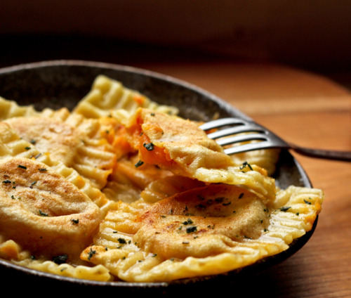

# Chilli ravioli with crab

*Chilli pasta that looks and tastes sensational. Add a creamy crab filling and you've got a great talking point for a dinner party.*

**Serves:** 4

## Ingredients
- 300 grams strong white flour
- 1 teaspoon salt
- 2 teaspoon crushed dried red chillies
- 3 eggs
- 75 grams butter
- Juice of 1 lemon
- A few leaves of basil (chopped)

### For the filling
- 175 grams mascarpone cheese
- 175 crab meat
- 2 tablespoons flat leaf parsley (freshly chopped)
- Rind of 1 lemon (finely grated)
- Pinch of crushed dried chillies
- Salt and freshly ground black pepper

## Method
### To make the pasta
1. Make a well in the middle of the flour, and crack the eggs into the well, add the dried chillies and salt.
1. Gradually bring in the sides of the flour mixing into the egg, so that the egg binds with the flour. 
1. Roll into a ball and kneed for 10 minutes.
1. Place the dough into a bowl, and cover with cling film and refrigerate for 30 minutes.
1. Once chilled, kneed the dough again for 10 minutes and roll out flat with a rolling pin.

### To make the filling
1. Put the mascarpone in a bowl and mash it with a fork.
1. Add the crab meat, parsley, lemon rind and crushed dried chillies.
1. Season to taste with salt and freshly ground black pepper.
1. Stir well.

### To make the ravioli
1. Using a pasta machine, roll out one-quarter of the dough to a 90 cm strip, and cut into two lengths.
1. With a 6 cm fluted cutter, cut out 8 squares from each strip.
1. Using a teaspoon, put a mound of filling in the centre of half the squares.
1. Brush a little water around the edge of the filled squares, then top with the plain squares and press the edges to seal.
1. For a decorative finish, press the edge with the tines of a fork.
1. Put the ravioli on floured tea-towels, sprinkle lightly with flour and leave to dry while repeating the process to make 32 ravioli in total.
1. Bring a large pan of salted water to the boil, and cook the ravioli, in batches for 4 - 5 minutes.
1. Meanwhile, melt the butter and lemon juice in a small pan until sizzling.
1. Drain the ravioli and divide them among 4 warmed bowls.
1. Drizzle the lemon butter over the ravioli, sprinkle with some crushed chillies and basil.
1. Serve at once.