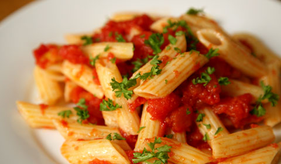

# Penne with red chillies, garlic and chopped tomatoes

*Penne all' Arrabbiata*

*This classic dish is the ultimate comfort food, and is very easy to prepare and cook. You can substitute the tinned tomatoes for fresh tomatoes if you prefer. If using fresh tomatoes, make sure the seeds are discarded or the sauce will end up too thin.*

**Serves:** 4

## Ingredients
- 6 tablespoons extra virgin olive oil
- 2 garlic cloves (peeled and chopped)
- 2 medium-hot red chillies (de-seeded and finely chopped)
- 800 grams chopped tomatoes
- 4 tablespoons flat leaf parsley (freshly chopped)
- 500 grams penne rigate
- salt to taste

## Method
1. Heat the oil in a large frying pan over a medium heat and add the garlic and chilli, frying for about 1 minute, stirring with a wooden spatula.
1. Pour in the chopped tomatoes and 3 tablespoons of the parsley, stir well and simmer gently, uncovered, for about 10 minutes, stirring every couple of minutes.
1. Once ready, season with salt, remove from the heat and set aside.
1. Meanwhile, cook the pasta in a large saucepan of boiling salted water until al dente. Drain and tip back into the same pan.
1. Put the saucepan back over a low heat, pour in the Arrabbiata sauce and stir everything together for about 1 minute to allow the flavours to combine.
1. Serve immediately sprinkled with the remaining chopped parsley and add grated Parmesan if you wish.