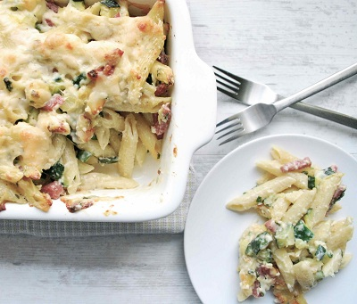

# Crispy topped pasta with courgettes and salami

*Penne con zucchine e salame gratinate*

*This dish is filled with warm flavours, loaded with cheese. It is perfect served hot, warm or cold. It is simply delightful.*

**Serves:** 6

## Ingredients
- 6 tablespoons olive oil
- 2 large courgettes (cut into 5 mm cubes)
- 350 grams penne rigate
- 250 grams salami Milano (cut into small strips)
- 3 tablespoons fresh flat leaf parsley (chopped)
- 100 grams Parmesan (freshly grated)
- butter (for greasing)
- salt and pepper to taste

### For the béchamel 
- 50 grams salted butter
- 50 grams plain flour
- 500 ml full fat milk (cold)
- half teaspoon paprika
- pinch of nutmeg (freshly grated)

## Method
1. Heat the oil in a large frying pan over a medium heat and fry the courgettes for 5 minutes, stirring occasionally. Season with salt and pepper then set aside
1. To prepare the béchamel sauce, melt the butter in a large saucepan over a medium heat. Stir in the flour and cook for 1 minute until it turns a light brown colour.
1. Gradually whisk in the milk, reduce the heat and cook for 10 minutes, whisking continuously. Once it has thickened, stir in the nutmeg. Season with salt and pepper and set aside to cool slightly.
1. Meanwhile, cook the pasta in a large saucepan of boiling salted water until al dente. Drain and tip into a large bowl with courgettes, salami, parsley, half of the Parmesan and half of the béchamel sauce. Gently mix everything together.
1. Preheat the grill to medium-high.
1. Butter a 22 cm round oven-proof dish with sides at least 4 cm deep.
1. Pour the pasta into the dish, cover with the remaining béchamel sauce and sprinkle over the remaining Parmesan.
1. Place the dish under the preheated grill and cook for 15 minutes until golden and crispy.
1. Once ready, leave to rest for 5 minutes. It will be easier to cut and serve as the layers will hold together.