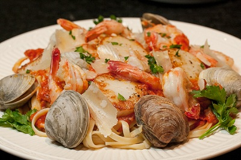

# Seafood linguine with chilli and white wine

*Linguine del mare*

*This classic Italian recipe guarantees you minimum effort yet maximum satisfaction. This dish has all the flavours of the sea, and leaves you with a satisfied palette and stomach.*

*Make sure that the seafood is fresh, and you don't overcook it.*

**Serves:** 4

## Ingredients
- 250 grams clams
- 250 grams mussels
- 250 grams baby squid (quartered)
- 250 grams uncooked prawns (peeled and de-veined)
- 100 ml dry white wine
- 6 tablespoons extra virgin olive oil
- 4 garlic cloves (peeled and sliced)
- 1/2 teaspoon dried chilli flakes
- 800 grams cherry tomatoes
- 4 tablespoons fresh flat leaf parsley (chopped)
- 500 grams linguine
- zest of 1 unwaxed lemon
- salt to taste

## Method
1. Wash the clams and mussels under cold water, discard and broken ones and those that do not close when tapped firmly.
1. Place in a large saucepan, pour in the wine, cover with the lid, and cook over a medium heat for 3 minutes until the shells have opened. Discard any shellfish that remain closed and tip the rest into a colander placed over a bowl to catch the cooking liquor. Set aside.
1. Heat the oil in the same saucepan that you used for the clams and mussels and gently fry the garlic until it begins to sizzle.
1. Add the chilli and the tomatoes and cook over a medium heat for 5 minutes.
1. Season with salt and stir occasionally.
1. Pour 6 tablespoons of the reserved cooking liquor from the shellfish into the sauce and continue to simmer for 2 minutes.
1. Stir in the baby squid and the prawns and continue to cook for a further 3 minutes until they turn pink.
1. Add the clams, mussels and the parsley and stir until heated through.
1. Meanwhile cook the pasta in a large saucepan of boiling salted water until al dente. Drain and tip into the pan with the sauce.
1. Sprinkle with the lemon zest and mix everything together over a low heat for 1 minutes to allow the sauce to coat the pasta evenly.
1. Serve immediately.