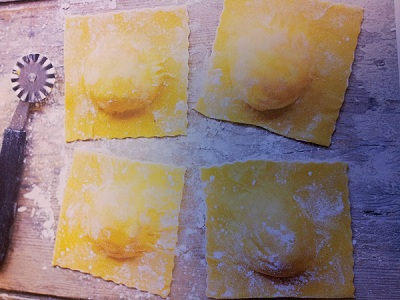

# Name

*Ravioli con chorizo piccante*

*This wonderful spicy ravioli dish is perfect for a starter, or as a main meal. The cheese adds a delicate undertone to this otherwise spicy dish.*

**Serves:** 6

## Ingredients
- 400 grams fresh pasta dough
- 2 eggs (beaten)
- 200 ml extra virgin olive oil

### For the filling
- 5 tablespoons olive oil
- 300 grams chorizo (finely chopped)
- 3 medium-hot chillies (de-seeded and finely chopped)
- 750 grams ricotta cheese
- 3 tablespoons fresh flat leaf parsley (finely chopped)
- salt and pepper to taste

## Method
1. To prepare the filling, heat the olive oil in a small frying pan over a medium heat and fry the chorizo with the chillies for 2 minutes, stirring occasionally. Set aside.
1. Place the cooled chorizo and chillies in a large bowl with the ricotta and parsley.
1. Mix everything together with a fork and season with salt.
1. Cover with cling film and leave to rest in the fridge for 10 minutes.
1. Flatten the prepared pasta dough with a rolling pin so that it can fit through the rollers of a pasta machine. Flour the pasta lightly on both sides and start to roll it, from the widest setting to the thinnest. Make sure that you keep the pasta dusted with flour at all times.
1. Make sure you have an even number of sheets of the same size.
1. Lay the pasta sheets on a well floured surface.
1. Put the teaspoons of filling at 4 cm intervals across half the rolled out dough. Brush the spaces between the fillings with the beaten egg.
1. Gently cover with another sheet of pasta, and press down between the parcels of filling.
1. Use a pastry wheel or a sharp knife to cut the pasta into squares between the fillings.
1. Cook the ravioli in a large saucepan of boiling salted water for 3 minutes (working in batches if necessary), drain and place in the middle of a large serving plate. Season with a little salt.
1. Drizzle over extra virgin olive oil, decorate with plenty of freshly ground black pepper and serve immediately.