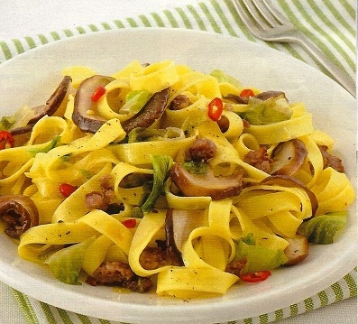

# Tagliatelle with sausage, rosemary and porcini mushroom

*Tagliatelle con salsicce e porcini*

*The Italian sausage and rich creamy sauce in this dish really brings the pasta alive. You can leave out the mushrooms if you wish.*

**Serves:** 4

## Ingredients
- 400 grams Italian sausage (or good quality pork sausage)
- 6 tablespoons olive oil
- 1 leek (washed and finely chopped)
- 2 tablespoons fresh rosemary leaves (finely chopped)
- 50 grams dried porcini mushrooms (soaked in warm water for 15 minutes and drained)
- 100 ml dry white wine
- 150 ml double cream
- 500 grams fresh tagliatelle
- salt and pepper to taste

## Method
1. Remove the skins from the sausages and place the meat mixture in a bowl.
1. Heat the oil in a large frying pan over a low heat and fry the sausage meat and the leek for 5 minutes, stirring occasionally with a wooden spatula to crumble the meat.
1. Add the rosemary and mushrooms, season with salt and pepper and continue to cook for 2 minutes.
1. Pour in the wine and cook for a further minute to allow the alcohol to evaporate.
1. Pour in the cream, mix everything together and cook for 1 minute. Set aside.
1. Meanwhile, cook the pasta in a large saucepan of boiling salted water until al dente. Drain and tip back into the same pan.
1. Pour in the cream sauce and toss everything together for 30 seconds to allow the flavours to combine.
1. Serve immediately.