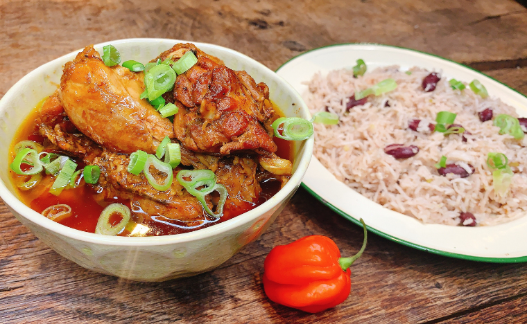

# Caribbean chicken curry stew

*In many Caribbean stew dishes there is an initial step of burning sugar in oil which is used to brown the meat in. This adds a very unique sweetness to the stews from this region and this sweetness paired with the unmistakable flavour (and heat) from the wonderful scotch bonnet chilli is simply astounding. I have used curry powder in this - yes curry powder! and I cannot tell you how much I love the flavour of this very simple, yet fragrant and delicious curry.*

*The flavour that the scotch bonnet gives is unmistakable and it is THE chilli of this region. It's used in pepper sauces as well as infamous Jerk chicken - it is not a chilli for the faint hearted. It reaches between 100,000 to 350,000 on the Scoville heat scale. It's fruity heat penetrates into stews and the meat so please be mindful and take it out of the stew once you think its hot enough for you.*

*The second point on this is that you would usually marinade the chicken with what is known as 'green seasoning'. This is a blend of specific ingredients that adds flavour and tenderises.*

**Serves:** 4

## Ingredients
- 5cm piece of ginger
- 6 cloves of garlic
- 1 tsp salt
- ½ tsp black peppercorns
- 4 spring onions
- Large pinch coriander
- Large pinch parsley
- 1 scotch bonnet (optional)

**For the curry** 
- 2 tbsp vegetable Oil
- 55g brown sugar
- 3 tsp curry powder
- 600ml water or stock
- 1 bay leaf
- 2 thyme sprigs
- 1 scotch bonnet
- shot of dark rum

## Method
1. Prep your chicken by cutting it into thigh, drumsticks, wings and breasts into pieces leaving the skin on.
1. Mince the ginger, garlic, salt, black pepper, green part of the spring onion, parsley, coriander and scotch bonnet (if using) but you can opt for a milder chilli if you prefer.
1. Marinade your chicken with the skin on for approx. 3 hours
1. Heat a pan with the oil and add the sugar. Let it melt until it starts to bubble and goes dark in colour.
1. It will turn frothy and look almost burnt, then stir in the curry powder.
1. Once sizzling and aromatic place the marinated chicken into the pan to brown. You may have to do this in batches. Let it darken and crisp.
1. Pour in the water or stock to cover the chicken and add a bay leaf, 2 sprigs of thyme a whole scotch bonnet and bring to the boil.
1. Reduce to a simmer and leave to cook for 30 minutes.
1. Stir in a shot of rum and simmer for another few minutes.
1. The chicken should be fragrant and falling away from the bone.
1. Slice the onion whites and sprinkle over the chicken - serve with some rice and peas.