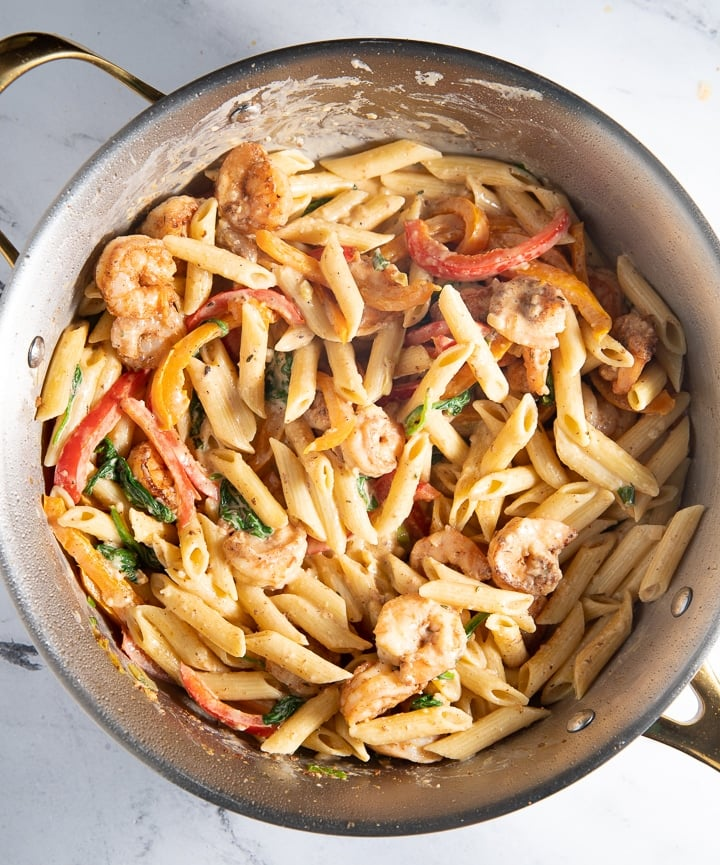

# Rasta  Pasta

**Serves:** 4

## Ingredients
- 227 grams penne pasta (about 2 dry cups)
- 454 grams prawns (peeled and deveined)
- 1 Tbsp. jerk seasoning
- 2 Tbsp. oil
- 1 red bell pepper (thinly sliced)
- 1 orange bell pepper (thinly sliced)
- 60 grams fresh spinach
- 2 spring onions
- 4 garlic cloves (minced)
- 170 ml pasta water (separated)
- 170 ml double cream
- 100 grams Parmesan cheese (shredded)

## Method
1. Prepare pasta according to directions on the box. Drain and set aside ½ pasta cup pasta water.
1. Coat prawns with 1 Tbsp of jerk seasoning.
1. Add oil to a large crock pot over medium heat. 
1. Cook prawns for 2-3 min per side. 
1. Remove prawns and set aside.
1. Deglaze the pan by adding ¼ cup pasta water. Using a wooden spoon, scrape any of the seasoning from the sides of the pan into the water.
1. Add peppers, spring onions, and garlic to the pan and cook until slightly softened about 5 minutes.
1. Add remaining pasta water, double cream, and remaining jerk seasoning and simmer for about 3 minutes.
1. Add the prawns.
1. Add pasta, spinach, and parmesan cheese and stir until coated.

*Alternative*
1. Substitue jerk seasoning for cajun spices for a wam, smokey cajun dish