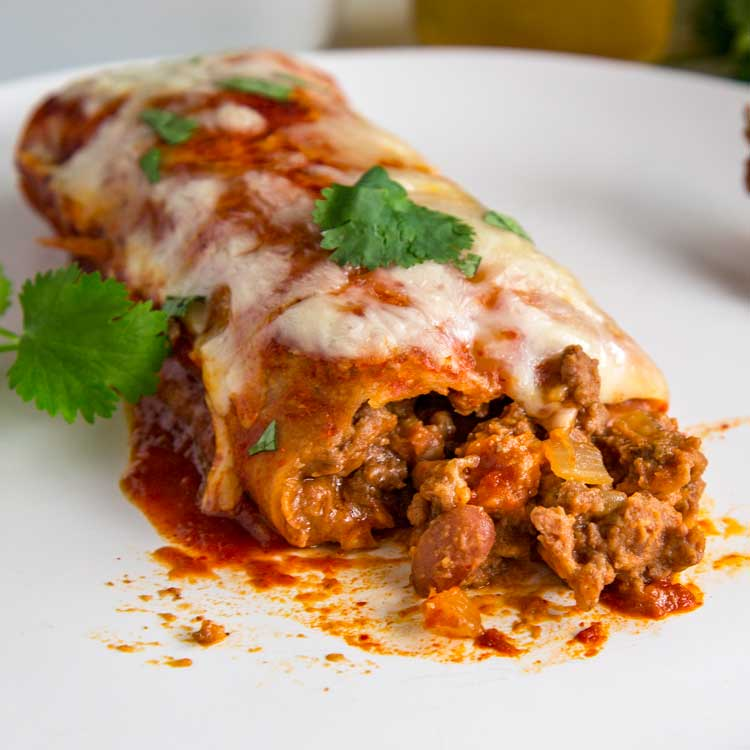

# Beef Enchiladas

*This Tex-Mex-inspired beef enchilada recipe is richly seasoned, easy to make, and always such a crowd favourite*

**Servings:** 8

## Ingredients
- 0.68 kilograms lean ground beef
- salt
- pepper
- 1 white onion (small, peeled and diced)
- 4 diced green chiles (de-seeded)
- 439 grams black beans (or lentils, rinsed and drained)
- 8 large flour tortillas
- 339 grams shredded cheese (Mexican-blend)
- 350ml [red enchilada sauce ](./enchilada-sauce.md)
- 4 grams chopped fresh coriander

## Method
### Sauté the beef filling. 
1. Heat oil in a large sauté pan over medium-high heat. 
1. Add the onion and garlic and sauté for 3 minutes, stirring occasionally. 
1. Add the ground beef and cumin and sauté for 5 minutes or until completely browned, crumbling the beef with a wooden spoon as it cooks. 
1. Stir in the beans and green chiles until combined. 
1. Season the mixture with a few generous pinches of salt and pepper, to taste.
1. Heat oven to 180°C. 
1. Spread 1/2 cup of the enchilada sauce evenly along the bottom of a 9 x 13-inch baking dish.

### Assemble the enchiladas. 
1. To assemble the enchiladas, set up an assembly line including: tortillas, enchilada sauce, beef filling, and cheese. 
1. Lay out a tortilla, and spread two tablespoons of sauce over the surface of the tortilla. 
1. Add a generous spoonful of the beef filling in a line down the center of the tortilla, then sprinkle with 1/3 cup cheese. 
1. Roll up the tortilla and place it in the prepared baking dish. 
1. Assemble the remaining enchiladas. Spread any remaining sauce evenly over the top of the enchiladas, followed by any extra cheese.

### Bake. 
1. Bake uncovered for 20 minutes, or until the enchiladas are cooked through and the tortillas are slightly crispy on the outside. 
1. Transfer the baking dish to a wire rack.

### Serve. 
1. Serve the enchiladas immediately while they’re nice and hot, garnished with lots of your favorite toppings.
