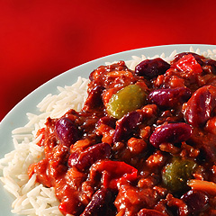

# Chilli con carne

**Serves:** 6

## Ingredients
- 1 large onion
- 2 cloves garlic
- 1 stick celery
- 1 carrot
- minced beef

**Spices**  
- 1 1/2 tablespoons whole cumin seeds
- 2 whole cloves
- 1 1/2 teaspoons whole coriander powder
- 125ml stock
- 1 teaspoon chilli powder
- 1 teaspoon marmite
- 2 teaspoons soy sauce
- 1 tablespoon balsamic
- 2 tablespoons tomato paste
- black pepper
- 1 star anise

**Sauce**  
- 1 tin of kindey beans
- 1 tin of baked peans
- 2x 500 gram bottles of passata (Napolina preferably)

## Method
### Prepare spices
1.  Toast cumin seeds and cloves until they begin to smoke
1. Grind them in a pestle and mortar
1. Add to stock
1. Add marmite, soy, balsamic, chilli powder, coriander powder and tomato paste to stock and stir in

### Sweat vegetables
1. Grate carrot and celery
1. chop onion
1. Fry the carrot, celery, garlic and onion in some oil on a medium-low heat and add the lid to the pan to sweat for 15 minutes, stirring occasionally

### Cook the chilli
1. Add the meat and cook until it browns
1. Tip in the spice stock
1. Add the beans and passata and stir
1. Increase the heat until it bubbles
1. Reduce the heat to low
1. Add some black pepper
1. Add the star anise and cook for 1 hour
1. Remove the star anise and serve