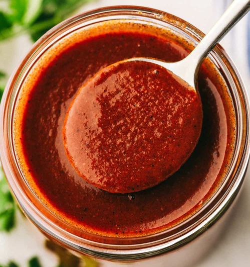

# Authentic Enchilada Sauce

*Rich and robust and a thousand times better than store-bought, this authentic enchilada sauce packs some serious flavour*

**Servings:** 20

## Ingredients
- 85 grams dried ancho peppers
- 85 grams dried guajillo peppers
- 2-3 or more dried arbol peppers (optional for heat)
- 1 medium white onion, peeled and cut in half
- 2 ripe tomatoes, halved
- 4 cloves garlic, peeled
- 4 cups boiling water or chicken broth (for even more flavor)
- 1 teaspoon sea salt
- 1 teaspoon dried Mexican oregano
- 1 teaspoon ground cumin
- Small piece of semi-sweet chocolate (optional)

## Method
### Roasting
1. Heat a heavy non-stick skillet (I like to use cast iron) over medium-high heat.  Don't add any oil.  
1. Lay the dried peppers on the skillet and toast them for a minute or two on each, just until they become very fragrant.  It's better to under-toast than to over-toast them as they will become very bitter if scorched.  
1. Remove and set aside.  
1. Place the onion, garlic and tomatoes on the skillet and toast until lightly browned.
1. Remove the stems from the peppers (using gloves if you're using hot peppers), slice the peppers open and remove and discard all of the seeds and the membranes (contrary to popular belief, it's the membranes not the seeds that are hot, the seeds are bitter). 
1.Place the peppers in a bowl.

### Making the sauce
1. Pour the boiling water over the peppers, cover the bowl and let them sit for 20-30 minutes until soft.
1. Place the peppers and their liquid along with the onion, tomato, garlic and all remaining ingredients (except for the chocolate if using) in a blender and blend until completely smooth.

### Cooking the sauce
1. Heat a tablespoon or so of oil to a pot then add red sauce.  
1. Simmer it uncovered for about 30 minutes.  Add a little more water if you prefer it thinner.  The sauce should be the thickness of heavy cream.
1. *Optional:* For an added flavor touch, add a small piece of semi-sweet chocolate at the end and stir until melted.
1. If the sauce is very bitter, add a touch of brown sugar. 
