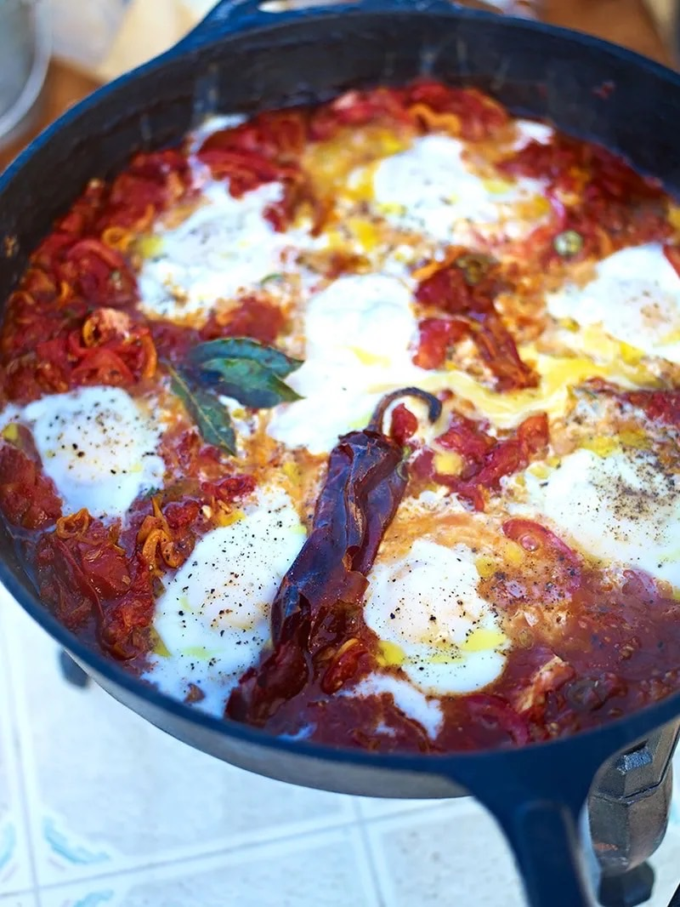

# Huevos Rancheros

**Serves:** 4

## Ingredients
- 1 onion 
- 2 cloves of garlic 
- 2 red peppers 
- 2 fresh red or orange chillies 
- olive oil 
- 1 large dried chilli 
- 3 fresh bay leaves 
- 2 x 400 g tins of quality plum tomatoes 
- 2 large ripe tomatoes 
- 6 large eggs 
- 6 tortillas 

## Method
1. Peel and finely slice the onions and garlic. Deseed and finely slice the peppers and chillies.
1. Get a large frying pan (make sure you’ve got a lid to go with it) on a high heat and add several good lugs of olive oil. 
1. Add the onion, garlic, peppers, fresh and dried chillies, bay leaves and a good pinch of sea salt and black pepper, and cook for 15 minutes, or until to softened and caramelised, stirring regularly.
1. Pour in the tomatoes, using a spoon or potato masher to break them up. Bring to the boil, then turn down to a medium heat and cook for a further 5 minutes to reduce the sauce.
1. When you’ve got a nice thick tomato stew consistency, have a taste and adjust the seasoning, if needed.
1. Slice the fresh tomatoes and lay them over the top of the mixture.
1. Use a spoon to make small wells in the tomato stew, then crack in the eggs so they poach in the thick, delicious juices – try to crack them in as quickly as you can so they all get to cook for roughly the same amount of time. 
1. Season from a height, put the lid on and let the eggs cook for around 3 to 4 minutes, or until cooked to your liking. 
1. Warm the tortillas while this is happening. You can pop them into the oven at 180°C/350°F/gas 4 for a few minutes, microwave them for a few seconds or even lay them over the lid of the pan so they heat up as the eggs cook.
1. Take the lid off and check your eggs by giving them a poke with your finger. When they’re done to your liking, turn the heat off and take the pan to the table with the warmed tortillas, the Cheddar and a grater so everyone can get involved and make their own. Personally, I like to grate a bit of cheese right on to a warm tortilla, spoon an egg and some of the wonderful tomato stew on top, wrap it up, and eat it right away. What a beautiful way to wake up!