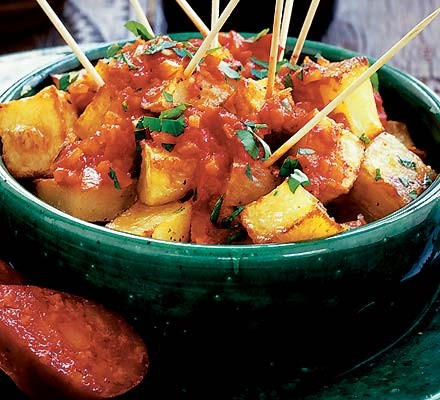

# Patatas bravas

**Serves:** 10 - 12 as a side

## Ingredients
- For the sauce
- 3 tbsp olive oil
- 1 small onion, chopped
- 2 garlic cloves, chopped
- 227g can chopped tomatoes
- 1 tbsp tomato purée
- 2 tsp sweet paprika 
- good pinch chilli powder
- pinch sugar
- chopped fresh parsley, to garnish

### For the potatoes
- 900g potatoes, cut into small cubes
- 2 tbsp olive oil

## Method
### Step 1
1. Heat the oil in a pan and fry the onion for about 5 mins until softened. 
1. Add the garlic, chopped tomatoes, tomato purée, sweet paprika, chilli powder, sugar and a pinch of salt, then bring to the boil, stirring occasionally. 
1. Lower to a simmer and cook for 10 mins until pulpy. 
1. Can be kept chilled for up to 24 hrs.

### Step 2
1. Heat oven to 180C fan. 
1. Pat the potatoes dry with kitchen paper, then tip into a roasting tin and toss in the olive oil and some seasoning. 
1. Roast for 40-50 mins until crisp and golden. 
1. Tip the potatoes into serving dishes and spoon over the tomato sauce. 
1. Sprinkle with some fresh parsley to serve.