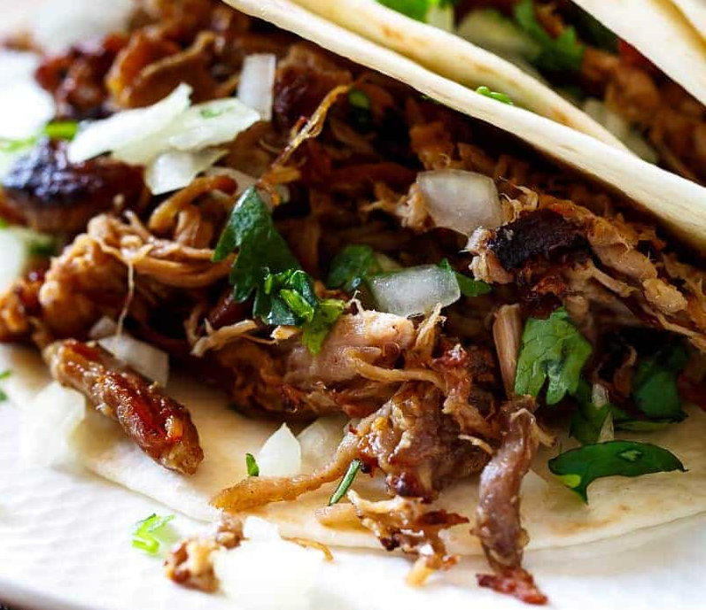

# Crispy pork carnitas

*Carnitas are so versatile, you can fill any burrito, taco, quesadilla or use them in a salad*

**Serves:** 8

## Ingredients
- 1kg skinless, boneless pork shoulder
- 2 teaspoons salt
- 1/2 teaspoon pepper
- 1/2 tablespoon dried oregano 
- 1/2 tablespoon ground cumin
- 1 small onion (cut into wedges)
- 4 cloves garlic (smashed)
- 1 lime (juiced)
- 1 large orange (juiced)
- 1/3 cup coke
- 1 bay leaf

## Method
1. Rinse and pat dry pork with a paper towel.
1. In the bowl of a slow cooker, add: pork, salt, pepper, oregano, cumin, onion, garlic, lime juice, orange juice, coke, and bay leaves.
1. Cover and cook on low heat setting for 8-10 hours, or high heat for 5-6 hours (until the meat falls apart).
1. Remove pork and shred with two forks (Do not disgard the liquid)

### To crisp in the oven
1. Transfer the pork to a baking sheet lightly sprayed with cooking oil spray (or lined with foil or parchment paper).
1, Pour 1 ladle full (about 1 cup) of the liquid from the slow cooker over the pork to season. 
1. Broil for 5-10 minutes on high heat until the meat becomes golden browned and crispy on the edges.

### To serve
1. Season with a little extra salt and pepper if desired. 
1. Pour over more of the slow cooker juices once the meat has crisped for added flavour, just before serving
1. Serve in Tacos, Burritos, or in a salad