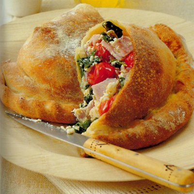

# Calzone

*A folded pizza encloses a fragrant filling with lovely intense flavours. Unlike most calzoni, the dough is fine and the filling is generous.*

**Serves:** 2

## Ingredients
- 320 grams [pizza dough](../../bread-pasta/pizza-dough.md)
- 200 grams cherry tomatoes
- 200 grams pancetta cubes
- 40 small basil leaves
- 60 ml extra virgin olive oil
- salt and freshly ground pepper
- 200 grams ricotta

## Method
### For the filling
1. Put the cherry tomatoes in a bowl with the ham and basil.
1. Drizzle over the olive oil, season lightly and mix gently.
1. Leave to marinate for 20 minutes.
1. Just before shaping the calzoni, crumble in the ricotta and toss gently.

### Make the calzoni
1. Preheat the oven to 200°C.
1. On a lightly floured surface, roll out half the pizza dough to a 20 cm diameter disc.
1. Lightly flour the dough, then roll it loosely over a rolling pin and unroll it onto a baking sheet.
1. Dip your fingertips in a little flour, then push the dough outwards to make a perfectly round, evenly thin base.
1. Spoon half the filling over one half of the base, leaving a 2 cm margin.
1. Brush the border with cold water and fold one half of the dough over the other, then press the edges together with your fingertips.
1. Now, pushing the filling into the centre as you go, pinch the dough between your thumb and index finger, tuning it 90° every centimetre to plait and seal the border. 
1. Use the other portion of dough and remaining filling to make a second calzone.
1. Bake for 20 minutes, then immediately slide onto a wire rack using a palette knife.
1. Cut each calzoni in half and serve immediately.