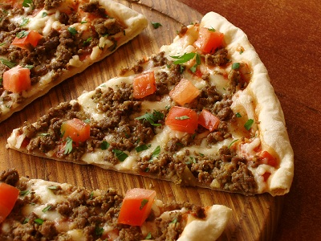

# Chilli beef pizza

*This is an amazing pizza, packed full of flavour with a subtle kick. Serve it with salad and garlic bread, or cut it into fingers and serve it with a picnic*

**Serves:** 4

## Ingredients
### Passata
- 200 grams plum tomatoes 
- 1 teaspoon oregano
- salt and pepper

### Pizza topping
- 220 grams [pizza dough](../../bread-pasta/pizza-dough.md)
- 115 grams canned red kidney beans 
- 175 grams lean mince
- 1 tablespoon olive oil
- 1 red onion (very finely chopped)
- 1 garlic clove (crushed)
- ½ red pepper (finely chopped)
- ½ teaspoon ground cumin
- 2 fresh red chillies (chopped)
- 50 grams mozarella (shredded)
- 75 grams cheddar (grated)
- 1 tablespoon oregano (chopped)
- salt and freshly ground black pepper

## Method
### To make the passata
1. Put a fine-meshed conical sieve over a bowl and tip the tinned tomatoes in to the sieve.
1. Press down on the tomatoes with the back of a ladle so that all of their juices are strained in to the bowl.
1. Tip the tomato juice into a small saucepan and simmer over a very low heat.
1. Add the vines from the cherry tomatoes to the tomato sauce along with the oregano.
1. Stir the sauce every few minutes or so until the sauce thickens to the consistency of a thick soup.
1. Tip the passata into a bowl and season lightly with salt and pepper, and a little drizzle of olive oil.

### To make the topping
1. Heat the olive oil in a frying pan and gently fry the onion, garlic and pepper until soft.
1. Increase the heat to medium - high and add the beef.
1. Brown the beef, stirring continuously.
1. Add the chopped chillies with the cumin and continue to cook for about 5 minutes, stirring continuously.
1. Add the kidney beans and check for seasoning.
1. Reduce the heat and simmer gently for about 10 minutes, then remove from the heat and set aside.
1. Cook for about 10 minutes and then set aside.

### To make the pizza base
1. Place the pizza dough on a lightly floured surface (ideally granite or marble) and roll out to the size of the baking sheet or pizza stone, about 3 mm thick.
1. Very lightly flour the the dough and then drape it over a rolling pin.
1. Unroll the pizza on to a lightly oiled baking sheet or pizza stone, and with your finger tips push the dough outwards towards the edge of the tine or stone.

###  Assemble the pizza
1. Preheat the oven to 220°C.
1. Spread out the passata on to the pizza base with a spoon, leaving a 1 cm edge around the pizza base.
1. Spoon over the beef and kidney bean mixture, and sprinkle the oregano over the top.
1. Sprinkle over the mozzarella and cheddar cheese over the pizza and place in the oven.
1. Cook for about 18 minutes until crisp and golden.
1. Serve immediately at the table.