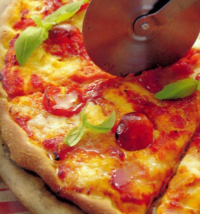

# Pizza margherita

*The margherita pizza, Italy's most famous pizza never fails to excite the senses and is extremely easy and satisfying to make. Using our pizza dough Pizza and fresh, ripe ingredients you will be able to create an authentic pizza that would make any Italian proud.*

**Serves:** 8

## Ingredients
### Passata
- 200 grams plum tomatoes
- 1 teaspoon oregano
- salt and pepper

### Pizza
- 220 grams [pizza dough](../../bread-pasta/pizza-dough.md)
- 150 grams buffalo mozzarella
- 120 grams cherry tomatoes
- 60 ml extra virgin olive oil
- 24 basil leaves
- 1 teaspoon oregano
- olive oil
- salt and pepper

## Method
### To marinate the cherry tomatoes
1. Cut the cherry tomatoes in half and place in a small bowl.
1. Pour over the olive oil and mix well so that all the tomatoes are covered in oil.
1. Season lightly with salt and freshly ground black pepper and leave to marinate for about half and hour.

### To make the passata
1. Put a fine-meshed conical sieve over a bowl and tip the tinned tomatoes in to the sieve.
1. Press down on the tomatoes with the back of a ladle so that all of their juices are strained in to the bowl.
1. Tip the tomato juice into a small saucepan and simmer over a very low heat.
1. Add the vines from the cherry tomatoes to the tomato sauce along with the oregano.
1. Stir the sauce every few minutes or so until the sauce thickens to the consistency of a thick soup.
1. Tip the passata into a bowl and season lightly with salt and pepper, and a little drizzle of olive oil.

### To make the pizza base
1. Place the pizza dough on a lightly floured surface (ideally granite or marble) and roll out to the size of the baking sheet or pizza stone, about 3 mm thick.
1. Very lightly flour the the dough and then drape it over a rolling pin.
1. Unroll the pizza on to a lightly oiled baking sheet or pizza stone, and with your finger tips push the dough outwards towards the edge of the tine or stone.

### Assemble the pizza
1. Preheat the oven to 200°C.
1. Spread out the passata on to the pizza base with a spoon, leaving a 1 cm edge around the pizza base, then arrange the marinated cherry tomatoes around the pizza.
1. Chop the mozzarella into 1 cm cubes and arrange around the pizza.
1. Sprinkle over the oregano and bake in the oven for 18 minutes.
1. Use a palette knife to slide the pizza on to a wire rack, sprinkle over the basil leaves and drizzle lightly with a little olive oil.