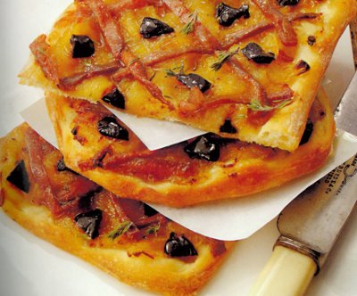

# Pissaladièrs

*These French variations on pizza are in fact ideal either as a snack or cut into small fingers for canapés.*

**Serves:** 4

## Ingredients
- 200 grams [pizza dough](../../bread-pasta/pizza-dough.md)
- 100 ml light olive oil
- 800 grams onions (very thinly sliced)
- 2 garlic cloves
- 1 bouquet garni (to include a few oregano sprigs and fennel stalks)
- salt and freshly ground pepper
- 18 anchovy fillets (soaked in milk for an hour if salty)
- 40 small black olives
- 1 teaspoon tiny thyme sprigs

## Method
1. Heat the olive oil in a heavy-based saucepan.
1. Add the onions, garlic and bouquet garni and season very lightly with salt.
1. Cover and cook very gently over a very low heat for 2 hours, stirring with a wooden spoon every 20 minutes and making sure that the onion does not colour.
1. When meltingly tender and lightly confit, tip them into a bowl, discarding the garlic and bouquet garni.
1. Leave to cool at room temperature.
1. Drain off any excess oil.

### For the base
1. On a lightly floured surface, roll out half the pizza dough to a 28 x 12 cm rectangle.
1. Lightly flour the dough, then roll it loosely over a rolling pin and unroll it onto a baking sheet.
1. Dip your fingertips in a little flour, then press the dough all over to make a very thin, even base.
1. Repeat with the other pieces of dough and rest in the refrigerator for 20 minutes.

### Assemble the pissaladièrs
1. Preheat the oven (preferable non fan) to 200°C.
1. Use a fork to spread the onions lightly and evenly over the pizza bases.
1. Arrange the anchovies in a lattice over the onions, and put the olives in the middle of the lattices.
1. Bake for 10 minutes, then immediately scatter over the thyme sprigs.
1. Use a palette knife to slide the pissaladièrs onto a wire rack.
1. Cut each one into four and serve piping hot, allowing two pieces per person.