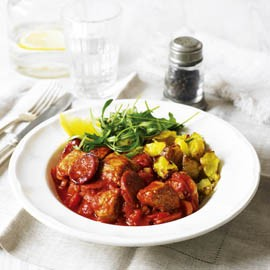

# Chorizo pork with crispy new potatoes

**Serves:** 4

## Ingredients
- 500 grams baby new potatoes
- 2 tablespoons olive oil
- 400 grams pork tenderloin, cut in to chunks
- 150 grams chorizo
- 1 red onion, sliced
- 500 grams tinned tomatoes (chopped)
- large pinch chilli flakes
- 1 lemon, juiced
- 4 lemon quarters
- pinch of sugar

## Method
1. Boil the potatoes for 10 minutes until tender. 
1. Drain the potatoes and roughly mash with a fork. 
1. Spread the potatoes out on a roasting tin, season and drizzle with half the oil. 
1. Grill for about 5 to 10 minutes, until crisp and golden.
1. In a pan, fry the pork with the remaining oil until browned and cooked through. 
1. Remove the pork and set aside.
1. Fry the chorizo over a medium heat until some of the fat is released, then add the onion and cooked for 5 minutes.
1. Drain off some of the fat from the chorizo and add the tomatoes, chilli, sugar and half the lemon juice. 
1. Bring to the boil and then reduce to a simmer for 10 minutes.
1. Return the pork to the pan and heat through. 
1. Add the remaining lemon juice and season well. 
1. Serve with the potatoes, rocket and lemon quarters.