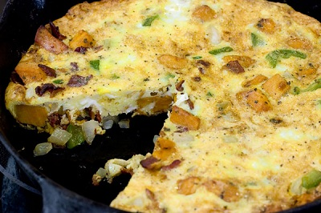

# Spanish omelette (Omelette à l'espagnole)

*This Spanish omelette has onions, peppers, tomatoes and potato cooked through it.*

**Prep Time:** 40 minutes
**Cooking Time:** 15 minutes
**Serves:** 2

## Ingredients
- 1 tablespoon olive oil
- 1 medium onion
- 2 medium tomatoes
- 250 grams baby new potatoes
- 1 cloves of garlic
- 1 bouquet garni
- 6 eggs
- 1 chorizo sausage (chopped)
- 1/2 teaspoon neutral oil
- butter
- salt and freshly ground black pepper
- Green pepper

## Method
1. Remove the skin, pith and seeds from the peppers, and chop into small dice.
1. Peel the onion, and chop in half. Chop the onion into small dice.
1. Peel and de-seed the tomatoes. Dice the remaining flesh.
1. Peel and de-germ the garlic. Chop into small dice.
1. Chop the potato into small 5 mm squares.
1. Finely dice the chorizo.
1. Heat the olive oil in a saucepan over a medium heat. Add the onion, chorizo and potato. Cook gently for 20 minutes, stirring with a wooden spoon. 
1. Remove the bouquet garni.
1. Meanwhile, boil the potatoes  for 10 minutes or until tender
1. Add the peppers, garlic and bouquet garni with a pinch of salt and pepper. Lower the heat and cook for 20 minutes.
1. Crack the eggs into a bowl. Add a pinch of salt and pepper and beat firmly with a whisk, to obtain a foamy mixture.
1. Heat the oil in a frying pan over a medium heat. Add a knob of butter.
1. When the butter foams, pour in the eggs, along with the onion, potato and diced tomatoes, stir with a wooden spatula for 2 minutes, or until the eggs begins to coagulate.
1. Twirl the frying pan to distribute the fats evenly over its bottom and sides. When the butter is melted and foamy, pour in the beaten eggs. They should immediately begin to solidify. Reduce the pan to a low heat.
1. With a wooden spatula, quickly scrape up the eggs cooked on the bottom and sides of the pan, pulling them to the centre.
1. Use a corner of the spatula to prick small holes in the cooking eggs.
1. Spin the frying pan regularly for an even distribution of heat.
1. Pull the cooked parts from the bottom and sides to the centre several times.
1. After 5 minutes, simply shake the frying pan for 1 to 2 minutes more for a moist omelette. If you like a firmer omelette, cook for 3 minutes more.
1. Turn off the heat and add a knob of butter to the pan. Allow it to melt all around the omelette; this will take care of any potential sticking.