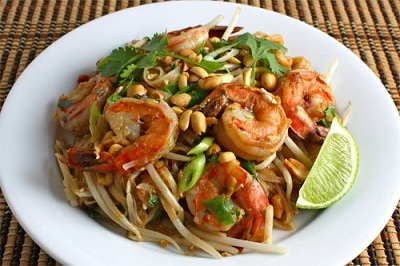

# Pad Thai

*This classic Thai dish of noodles is both aromatic and lightly spicy, it serves well as either a main course or a starter.*

**Serves:** 4

## Ingredients
- 110 grams dried rice noodles
- 3 tablespoons groundnut oil
- 2 cloves garlic (very finely chopped)
- 3 cm cube of ginger very (finely chopped)
- 1 teaspoon Red Curry Paste
- 1 teaspoon chilli sauce
- 1 teaspoon oyster sauce
- 200 ml chicken stock
- 100 grams skinned chicken breast (cut into strips)
- 100 grams lean pork (minced)
- 8 cooked king prawns
- 20 prawns
- 1 tablespoon red bell pepper (chopped)
- 2 red chillies(chopped)
- 2 tablespoons bean sprouts
- 3 tablespoons spring onions(chopped)
- 2 tablespoons basil leaves (chopped)
- 1 tablespoon coriander leaves (chopped)
- sweet soy sauce
- fish sauce
- 2 tablespoons peanuts (roasted and roughly crushed)
- 1 teaspoon palm sugar
- Thai Basil leaves (to garnish)

## Method
1. Bring a litre of water to the boil in a large saucepan.
1. Break up the noodles a little, as you add them to the saucepan, and move them around to help them break up.
1. Take the pan of the heat and put it to one side.
1. Heat the oil in the wok, stir-fry the garlic, ginger, red curry paste and chilli and oyster sauce for 30 seconds.
1. Add the stock or water and when it is simmering, add the chicken and pork. Stir-fry for about 3 minutes.
1. Add the prawns and continue to stir-fry for a further 3 minutes.
1. Add the remaining ingredients, drain the noodles and add them to the wok.
1. Season with soy and fish sauce.
1. Garnish with basil leaves and serve.