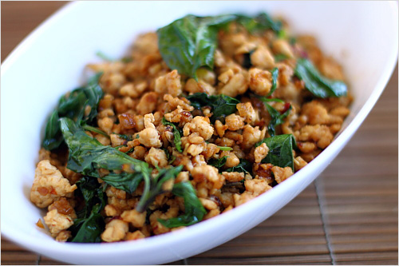

# Stir fried chicken with chilli and basil

*Pad krapow kai*

*This quick and easy chicken dish is an excellent introduction to Thai cuisine. Fiery chillies partner the holy basil, which has a pungent flavour that is spicy and sharp.*

**Serves:** 4 - 6

## Ingredients
- 450 grams skinless chicken breasts
- 3 tablespoons vegetable oil
- 4 garlic cloves (thinly sliced)
- 4 fresh red chillies (de-seeded and finely chopped)
- 3 tablespoons Thai fish sauce
- 2 teaspoons dark soy sauce
- 1 teaspoon granulated sugar
- 12 holy basil leaves
- 2 fresh red chillies (de-seeded and very finely chopped to garnish)
- 20 deep fried holy basil leaves (to garnish)

## Method
1. Using a sharp knife, cut the chicken breasts into bite-size pieces.
1. Heat the oil in a wok.
1. Add the garlic and chillies and stir-fry over a medium heat for 1 - 2 minutes until the garlic is golden.
1. Do not let the garlic burn or it will taste bitter.
1. Add the pieces of chicken to the wok and stir-fry until they change colour.
1. Stir in the fish sauce, soy sauce and sugar.
1. Stir-fry the mixture for 3 - 4 minutes or until the chicken is fully cooked.
1. Stir in the fresh basil leaves.
1. Spoon the mixture on to a warm serving platter, or individual serving dishes, garnish with the chopped chillies and deep-fried basil, and serve.

*Holy basil is native to Asia and it differ from other basils in that the heat develops the flavour. The leaves have the typical basil fragrance with the addition of pepper and mint. A substitute is a mix of ordinary basil and spearmint.*

*To deep-fry holy basil leaves, first make sure that the leaves are dry to they will splutter when added to the oil. Dee[=fru the leaves briefly in hot oil until they are crisp and translucent - this will take about 30 - 40 seconds. Lif out the leaves using a slotted spoon and leave them to drain on kitchen paper.*