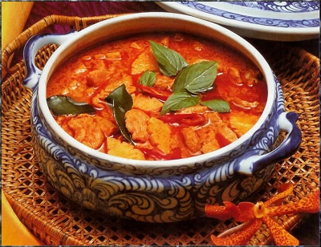

# Red chicken curry

*Gaeng phed gai*

*The chilli paste that is the basis of this dish has a superb flavour and will come in useful in all sorts of spicy dishes, so it is worth making in quantity.*

*It is worth taking the extra time and effort to pound all the herbs and spices using a mortar and pestle, as this will release their fragrances perfectly.*

**Serves:** 4-6

## Ingredients
- 1 litre coconut milk
- 450 grams skinless chicken breast (diced)
- 2 tablespoons Thai fish sauce
- 1 tablespoon granulated sugar
- 225 grams bamboo shoots (rinsed and sliced)
- 5 kaffir lime leaves (torn)
- salt and freshly ground black pepper

### For the red curry paste
- 15 red chillies (de-seeded)
- 4 shallots (thinly sliced)
- 2 garlic cloves (chopped)
- 1 tablespoon galangal (freshly chopped)
- 2 lemon grass (tender potions chopped)
- 3 kaffir lime leaves (chopped)
- 4 coriander roots
- 10 black peppercorns
- 1 teaspoon coriander seeds
- ½ teaspoon cumin seeds
- pinch of ground cinnamon
- 1 teaspoon ground tumeric
- ½ teaspoon shrimp paste
- 2 tablespoon oil(to garnish)

## Method
### To make the red curry paste

1. Mix together all of the paste ingredients in a bowl.
1. In batches, add some paste mix to a mortar with a pinch of salt and pound until smooth.
1. Transfer the smooth paste to a fresh bowl, and continue with the remaining paste ingredients until all the paste has been made.
1. Add the oil to the paste a little at a time and blend in well.
1. Transfer the paste to a clean jar and refrigerate until ready to use.

### To make the curry
1. Pour half the coconut milk into a large heavy pan.
1. Gently bring to the boil, stirring all the time until the milk separates, then reduce the heat.
1. Add 2 tablespoons of the red curry paste, stir to mix, and cook for a few minutes to allow the flavours to develop.
1. The sauce should begin to thicken and will need to be stirred frequently to prevent it from sticking to the pan, add a little more coconut milk if necessary.
1. Add the chicken, fish sauce and sugar.
1. Fry for 3 - 5 minutes until the chicken changes colour, stirring constantly to prevent it from sticking.
1. Add the rest of the coconut milk, with the bamboo shoots and kaffir lime leaves.
1. Bring back to the boil and stir in salt and pepper to taste.
1. Serve garnished with the chillies, basil and mint leaves.