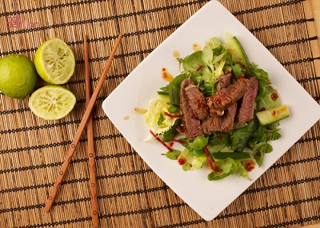

# Go Bo Hoi An

*Go Bo Hoi An*

*This piquant salad has delicate undertones of lime and garlic which carry through the taramind flavours perfectly.*

*This salad is very quick to make, make sure that the salad, dressing and toppings are made and ready to use before cooking the beef.*

**Serves:** 2

## Ingredients
### Marinade mixture
- 200 grams beef (frozen)
- 1 tablespoon taramind paste
- 1 teaspoon sugar
- salt and freshly ground black pepper
- 1 garlic clove (crushed)

### Salad
- 75 grams lettuce (shredded)
- 75 grams green papaya (grated)
- 75 grams tomatoes (de-seeded and thinly sliced)
- 75 grams cucumber (de-seeded and thinly sliced)
- half an white onion (thinly sliced)
- 4 fresh red chillies (de-seeded and thinly sliced)

### Dressing
- juice of 1 lime
- 1 tablespoon Thai fish sauce
- 3 tablespoons sugar
- 1 clove of garlic (crushed)

### Topping
- 30 grams mint
- 30 grams coriander
- 15 grams basil
- 2 tablespoons fried shallot slices
- 2 tablespoons peanuts (crushed)
- 2 roasted rice papers

## Method
1. Using a very sharp knife, slice the beef as thinly as possible (If the beef begins to thaw, place back in the freezer for 15 minutes). 
1. Mix together the marinate mixture with the beef, cover, and refrigerate for 3 hours.
1. Heat a large heavy-based frying pan or wok over a high flame, and add the beef, shaking the pan constantly for up to 2 minutes so that the beef is cooked through.
1. Place the salad mixture in a large serving bowl and toss with the dressing. 
1. Add the beef and mix gently.
1. Transfer the salad to a serving plate, and sprinkle over the topping.
1. Serve in baby baskets on a banana leaf with crispy rice paper.