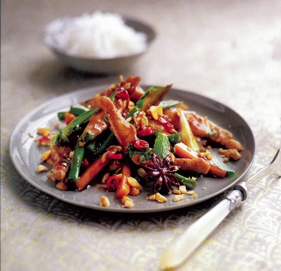

# Vietnamese chicken curry

*Even though Vietnam was colonized by the French, the traditional cuisine has more in common with their Chinese neighbours. Ground bean sauce is available in good Asian supermarkets, but if your cant find it, substitute oyster sauce instead.*

**Serves:** 4

## Ingredients
- 3 tablespoons sunflower oil
- 800 grams  skinless chicken breasts (cut into strips)
-  12 spring onions (cut into 3 cm lengths)
-  4 garlic cloves (finely chopped)
- 1 red chilli (finely sliced)
- 2 star anise
- 4 tablespoons lemon grass (very finely chopped)
- 1 teaspoon cardamom seeds (crushed)
- 1 cinnamon stick
-  300 green beans (halved)
- 1 carrot (cut into batons)
- 2 tablespoons fish sauce
- 2 tablespoons ground bean sauce
- small handful of coriander leaves (chopped)
- small handful fresh mint leaves (chopped)
- chopped roasted peanuts (to serve)

## Method
1. Heat half the sunflower oil in a large, non-stick frying pan and stir fry the chicken, in batches, for 1 - 2 minutes. Remove with a slotted spoon and keep warm.
1. Heat the remaining oil in the same frying pan and stir-fry the spring onions for 1 - 2 minutes, or until softened.
1. Add the garlic, chilli, star anise, lemongrass, cardamom seeds, cinnamon, green beans and carrots.
1. Stir-fry for 6 - 8 minutes.
1. Return the chicken to the pan with the fish sauce and ground bean sauce.
1. Stir-fry for 3 - 4 minutes, or until the chicken is cooked through.
1. Remove from the heat and sprinkle over the coriander, mint and peanuts before serving.