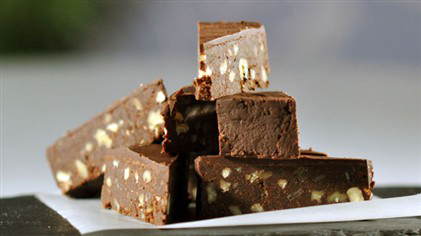

# Chocolate biscotti cake

**Yield:** 8

## Ingredients
- 250 grams dark chocolate
- 3 medium eggs
- 50 grams candied fruit peel
- 200 grams ground almonds
- 150 grams biscotti
- 200 grams icing sugar
- 4 table spoons amaretto

### For the topping
- 100 grams dark chocolate
- 70 grams icing sugar

## Method
1. Melt the chocolate in a large heatproof bowl over a pan of simmering water, ensuring that the base of the bowl does not touch the water.
1. Using a fork, beat the egg whites in a large bowl for two minutes. 
1. Add in the peel, ground almonds, the biscotti, icing sugar and Amaretto. 
1. Mix well then very gently fold in the melted chocolate.
1. Line a circular flan dish measuring about 18 cm across and 3 cm deep with cling film. 
1. Pour in the mixture and set aside for two hours.
1. To make the topping, melt the chocolate in a heatproof bowl over a pan of simmering water, ensuring that the base of the bowl does not touch the water.
1. Melt the icing sugar and two tablespoons of water in a small saucepan over a low heat.
1. Stir to check the sugar has melted, then add the chocolate to make a syrup.
1. Turn the cake out onto a plate and peel off the cling film. 
1. Use a spatula to cover the surface with the chocolate syrup. 
1. Set aside for one hour or until the chocolate has hardened.