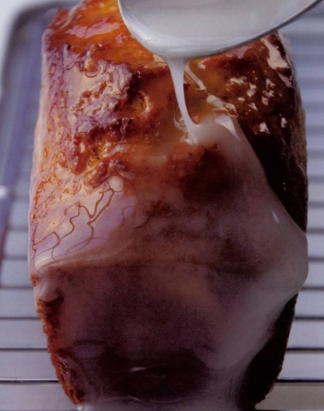

# Lemon cake

**Yield:** 2 cakes 

## Ingredients
- 50 grams butter (melted and cooled)
- butter (to grease)
- 3 small eggs (at room temperature)
- 175 grams caster sugar
- finely grated zest of 2 lemons
- pinch of salt
- 75 ml double cream
- 140 grams plain flour
- 1 teaspoon baking powder
- 50 ml dark rum
- 80 grams apricot jam (sieved)

###Icing
- 80 grams icing sugar
- juice of 1 lemon

## Method
1. Preheat the oven to 190°C.
1. Grease 2 loaf tins, 12.5 x 5 cm base measurement, about 5 cm deep with butter and line with greaseproof paper.
1. Lightly whisk the eggs, sugar, lemon zest and salt together in a bowl with a balloon whisk for 20 seconds.
1. Still whisking, pour in the cream and whisk until just combined.
1. Sift in the flour with the baking powder and whisk to mix for 30 seconds.
1. Add all but 2 teaspoons of the rum, stirring with the whisk until just incorporated.
1. Pour in the cooled, melted butter and mix until evenly combined, without overworking.
1. Divide the mixture between the prepared tins and bake for 5 minutes, then lower the oven temperature to 180°C and cook for a further 25 minutes until golden.
1. Immediately unmould the cakes onto a wire rack.
1. Sprinkle with the remaining rum over the surface, remove the greaseproof paper and leave to cool.
1. Turn the oven up to 240°C.
1. Heat the apricot jam in a small pan until just bubbling, then take off the heat.
1. Brush the tops and sides generously with the jam and leave on the wire rack for 5 minutes.
1. Mix the icing sugar and lemon juice in a bowl to form a smooth icing, and spoon over the tops of the cakes, with the cakes still on the racks and a baking tray placed underneath to catch any excess.
1. Place the cakes in the oven for 20 seconds, just enough time for the lemon icing to set as a glaze.
1. Leave to cool completely, then serve cut into thin slices.