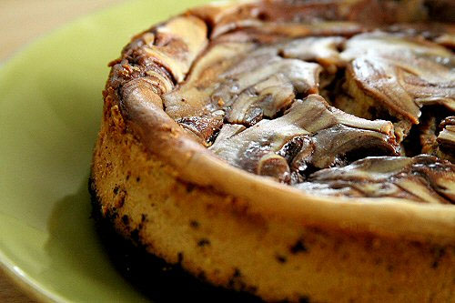

# Baked chocolate cheesecake with espresso sauce

*A rich cheesecake with a smooth velvety coffee sauce*

**Serves:** 4

## Ingredients
### For the pastry
- 175 grams plain flour
- 100 grams chopped butter
- 25 grams caster or icing sugar
- a little cold water
- zest of one orange

### For the filling
- 100 grams caster sugar
- 75 grams butter
- 200 grams dark chocolate(75% cocoa solids)
- 500 grams cream cheese
- 2 eggs, beaten

## For the sauce
- 150 ml Tia Maria or other coffee liqueur
- 2 tablespoons espresso coffee powder
- 2 tablespoons caster sugar

## Method
### For the pastry
1. Make the pastry by rubbing the flour, butter and sugar together with the orange zest and binding together with the water. 
1. Knead a little and leave to rest.
1. Line an 18 cm loose-bottom tin with the pastry, don't trim the edges but leave them to hang over.
1. Bake blind at 200° C for 15 minutes. 
1. Remove the baking beans and paper and cook for a further 5 minutes. 
1. Turn the oven down to 180°C.

### For the filling
1. Cream together the butter and sugar until light and fluffy.
1. Melt the chocolate, then add to the butter and sugar. 
1. Add the cream cheese and mix well.
1. Add the eggs and mix well.
1. Turn into the pastry case and bake for 30-35 minutes.
1. Leave to cool and then turn out.

### For the sauce
1. Place the liqueur in a saucepan and bring to the boil.
1. Stir in the coffee powder making sure it is well dissolved. 
1. Add the sugar and stir well.
1. Reduce the heat and simmer until it is the consistency of a thick syrup. 
1. Remove from the heat and leave to cool.